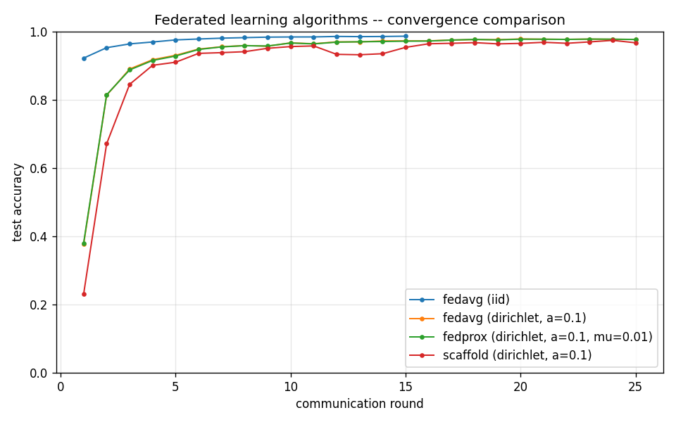

# Federated Learning Lab

[](https://github.com/waynehacking8/federated-learning-lab/actions/workflows/ci.yml)
[](LICENSE)

> A from-scratch implementation of canonical **federated learning**
> algorithms — FedAvg, FedProx, SCAFFOLD — with optional differential-
> privacy and secure-aggregation layers, evaluated on Non-IID
> partitions of MNIST.



Built as a self-study exercise to understand the algorithmic
machinery behind privacy-preserving distributed training. The repo
prioritizes **algorithmic correctness and clear measurement of
Non-IID degradation** over scale or production hardening.

---

## Headline results

All numbers are final test accuracy on MNIST, seed 0, reproduced
bit-exact on re-run. Full table in
[`results/SUMMARY.md`](results/SUMMARY.md); every number is
cross-checked against the literature in
[`docs/results-validation.md`](docs/results-validation.md).

| Setting | FedAvg | FedProx | SCAFFOLD |
|---|---|---|---|
| IID, K=10 | **0.986** | – | – |
| Dirichlet(α=0.1), K=10 | 0.977 | 0.977 (μ=0.01) | 0.967 |
| Label-skew(2), K=10 | 0.822 | 0.820 (μ=0.01) | **0.686** ⚠ |
| Label-skew(2), K=100 | 0.885 | 0.883 (μ=0.1) | **0.918** |

⚠ SCAFFOLD *underperforms* FedAvg at K=10 under extreme label skew —
its control variates go stale; at K=100 with partial participation
it wins by +3.3 pp. The crossover is documented in
[`docs/design-decisions.md`](docs/design-decisions.md).

Privacy & robustness:

- **DP-FedAvg** (σ=1.0, C=1): 0.906 accuracy at **ε ≈ 1.99**
  (RDP accountant, δ=1e-5); naive composition would claim ε ≈ 1426.
- **Gradient inversion (DLG)**: reconstructs a training image to
  MSE 3.8e-6 from plain gradients; per-sample clipping + noise
  breaks the attack (MSE 0.46).
- **Byzantine sign-flip** (2 of 10 clients): FedAvg collapses
  by >20 pp; coordinate-wise median and Krum stay within 5 pp of
  the clean baseline.

---

## What this is

- A clean PyTorch implementation of **FedAvg** (McMahan 2017) on
  MNIST with configurable client count, local epochs, and
  participation rate.
- Multiple **Non-IID partitioning schemes**: label-skew, quantity-skew,
  Dirichlet-α.
- Implementations of two **drift-mitigation variants**: FedProx
  (proximal term) and SCAFFOLD (control variates).
- An optional **differential-privacy module** wrapping local SGD
  with per-sample gradient clipping and Gaussian noise (DP-SGD).
- A secure-aggregation skeleton (additive-secret-sharing primitive,
  not full SecAgg protocol).
- Convergence-comparison plots: test accuracy vs Non-IID severity
  across all three algorithms.

## What this is NOT

- **Not a production framework.** No remote-procedure-call layer, no
  client authentication, no real network transport. All "clients"
  run in-process as separate state dictionaries.
- **Not a privacy audit.** The DP module follows DP-SGD's basic
  recipe but is not a certified privacy accountant. Production needs
  Opacus or TF-Privacy with rigorous ε accounting.
- **Not large-scale.** Single-machine simulation up to ~100 clients;
  beyond that the in-process model becomes the bottleneck.
- **Not aimed at LLM-scale fine-tuning.** A FedLoRA prototype on a
  small model is listed in the roadmap but is not the headline
  deliverable.

---

## Project layout

```
federated-learning-lab/
├── fl/
│   ├── server.py                  # Aggregator: collects updates, averages, broadcasts
│   ├── client.py                  # Local trainer: receives model, trains, returns delta
│   ├── algorithms/
│   │   ├── fedavg.py              # Vanilla FedAvg
│   │   ├── fedprox.py             # Proximal-term hook (client-side grad)
│   │   └── scaffold.py            # Control variates + server-side aggregator
│   ├── datasets/
│   │   └── mnist_partition.py     # IID, label-skew, Dirichlet-alpha
│   └── models/
│       └── cnn.py                 # Small CNN for MNIST (~46k params)
├── privacy/
│   ├── dp.py                      # DP-SGD primitives + DPSGDClient (vmap)
│   └── secagg.py                  # Additive secret sharing skeleton
├── scripts/
│   ├── experiment.py              # Shared experiment scaffolding
│   ├── run_fedavg_mnist.py        # FedAvg runner
│   ├── run_fedprox_mnist.py       # FedProx runner
│   ├── run_scaffold_mnist.py      # SCAFFOLD runner
│   ├── run_dp_fedavg.py           # DP-FedAvg runner
│   ├── secagg_demo.py             # Toy 3-client SecAgg demo
│   ├── run_all.py                 # Phase 1-4 in one process
│   ├── make_comparison_plots.py   # Cross-algorithm plot
│   └── make_summary.py            # SUMMARY.md from all metrics.json
├── docs/                          # algorithms, specs, design decisions, roadmap, refs
└── results/                       # Per-run artifacts + SUMMARY.md
```

---

## Quick start

```bash
python3 -m venv .venv && source .venv/bin/activate
pip install -r requirements.txt

# Sanity check: 50 unit tests, ~2 s on CPU.
pytest tests/ -q

# Phases 1-6: core algorithms.
python -m scripts.run_fedavg_mnist  --partition iid       --rounds 15
python -m scripts.run_fedavg_mnist  --partition dirichlet --alpha 0.1 --rounds 25
python -m scripts.run_fedprox_mnist --partition dirichlet --alpha 0.1 --mu 0.01 --rounds 25
python -m scripts.run_scaffold_mnist --partition dirichlet --alpha 0.1 --rounds 25
python -m scripts.run_dp_fedavg     --partition iid       --rounds 20 --noise-sigma 1.0
python -m scripts.secagg_demo

# Rigorous (RDP + PLD) epsilon accounting for the DP runs.
python -m scripts.dp_accounting_report

# Phases 7-10: personalization, robustness, server-optimizer, FedLoRA.
python -m scripts.run_fedper                      # FedPer (Dir(0.1))
python -m scripts.run_fedper label_skew 3         # FedPer (harder regime)
python -m scripts.run_robust                      # Krum/Median/Bulyan vs sign-flip
python -m scripts.run_dlg                         # gradient-leakage demo, DP breaks it
python -m scripts.run_fedopt                      # FedAdam server-side optimizer
python -m scripts.run_fedlora                     # FedIT + FedSA-LoRA (DistilBERT/AG News)

# Ablations + communication-cost analysis.
python -m scripts.run_ablations                   # E-sweep + mu cross-silo/device
python -m scripts.comm_cost                       # exact bytes/round per algorithm

# Or run the full phase 1-4 sweep in one go (sequential, ~45 min on a single GPU).
python -m scripts.run_all

# Build the cross-experiment summary after any combination of runs.
python -m scripts.make_summary
```

Each experiment writes ``results/<name>/{metrics.json, curve.png, REPORT.md}``.
``run_all`` additionally produces ``results/three_way_comparison.png`` and
``results/THREE_WAY_REPORT.md``; ``make_summary`` produces ``results/SUMMARY.md``.
All scripts default to ``--seed 0``; reported numbers are reproduced
bit-exact on re-run. Every reported number is cross-checked against
the literature in ``docs/results-validation.md``.

---

## Honest findings

Negative and surprising results are kept, not buried:

- [`docs/SELF_AUDIT.md`](docs/SELF_AUDIT.md) — self-audit of
  best-acc vs final-acc selection bias across all reported numbers.
- [`docs/results-validation.md`](docs/results-validation.md) — each
  headline number cross-checked against published baselines, with
  mechanistic explanations where they diverge.
- SCAFFOLD losing to FedAvg at K=10 extreme label skew, FedSA-LoRA's
  advantage not reproducing in the toy regime, and FedAdam's speed
  gate failing are all documented as-is in
  [`docs/design-decisions.md`](docs/design-decisions.md).
- Full experiment report (zh-TW):
  [`docs/experiment-report.zh-TW.md`](docs/experiment-report.zh-TW.md).

---

## Algorithms at a glance

| Algorithm | Idea | Trade-off |
|---|---|---|
| **FedAvg** (2017) | Weighted average of local model updates | Drifts under Non-IID; cheap |
| **FedProx** (2018) | Add `(μ/2)·\|w - w_global\|²` to local loss | Tolerates straggler clients; needs μ tuning |
| **SCAFFOLD** (2019) | Subtract drift via per-client control variates | Faster convergence; ~2× communication |

See [`docs/algorithms.md`](docs/algorithms.md) for derivations and
intuitions.

---

## Why these algorithms?

FedAvg is the baseline against which all federated work is measured.
FedProx and SCAFFOLD attack the same problem (client drift under
Non-IID data) from opposite directions — proximal regularization
versus direct gradient correction. Comparing them on the same
problem isolates the algorithmic trade-off cleanly. See
`docs/design-decisions.md` for the longer reasoning.

---

## Field context (why this matters in 2026)

This prototype implements the **unit test** for the FL stack that sits
underneath modern privacy-preserving and sovereign-AI deployments —
NVIDIA FLARE, Flower, the Google Federated Computing Platform, and
Apple Private Cloud Compute. Recent work that builds directly on the
algorithms reimplemented here:

- **FedSA-LoRA** (ICLR 2025) — share only the $A$ matrix in LoRA
  fine-tuning; SCAFFOLD-class drift correction continues to matter.
- **One-shot FL with diffusion** (arXiv 2505.02426) — compresses
  multi-round FL into one round using synthetic data.
- **Confidential-computing GPUs** (H100 → B200 TEE-I/O) — make the
  server side of FL attestable, while 2025–2026 TEE attacks show
  hardware isolation alone is not sufficient.

See [`docs/field-evolution.md`](docs/field-evolution.md) for the
longer narrative and the open questions in the field.

---

## References

See [`docs/references.md`](docs/references.md) for the full reading list
(now extended with the 2024–2026 sovereign-AI / confidential-computing
/ verifiable-inference lineage). Core foundational papers:

1. McMahan et al. (2017) — *Communication-Efficient Learning of Deep
   Networks from Decentralized Data* (FedAvg).
2. Li et al. (2018) — *Federated Optimization in Heterogeneous
   Networks* (FedProx).
3. Karimireddy et al. (2019) — *SCAFFOLD: Stochastic Controlled
   Averaging for Federated Learning*.
4. Abadi et al. (2016) — *Deep Learning with Differential Privacy*
   (DP-SGD).
5. Bonawitz et al. (2017) — *Practical Secure Aggregation for
   Privacy-Preserving Machine Learning*.
6. Khaled et al. (2020) — *Tighter Theory for Local SGD on Identical
   and Heterogeneous Data*.
7. FedSA-LoRA (ICLR 2025) — *Selective Aggregation for Federated
   Low-Rank Adaptation*.
8. Apple (2024) — *Private Cloud Compute: A new frontier for AI
   privacy in the cloud.*

---

## Author

Wei Cheng (Wayne) Chiu · [GitHub](https://github.com/waynehacking8) ·
M.S. Computer Science, NTUST (April 2026).

---

_Part of my portfolio — [waynehacking8.github.io](https://waynehacking8.github.io/)._
