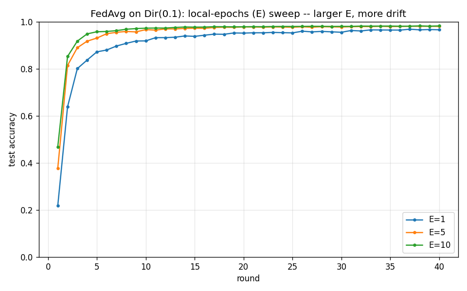

# E-sweep: local epochs vs client drift (Phase 2.2)

FedAvg on Dirichlet(0.1), 10 clients, 40 rounds.

| E (local epochs) | Final acc | Best acc | Round to 0.90 |
|---|---|---|---|
| 1 | 0.9658 | 0.9681 | 8 |
| 5 | 0.9802 | 0.9806 | 4 |
| 10 | 0.9822 | 0.9823 | 3 |

## Interpretation

The textbook claim is 'larger E -> more client drift -> lower
plateau' under Non-IID. On THIS partition (Dir(0.1), K=10) the data
shows the OPPOSITE: larger E converges faster and slightly higher
(E=1 -> 0.966, E=5 -> 0.980, E=10 -> 0.982). The reason is that
Dir(0.1) on 10 fully-participating clients is only mildly Non-IID --
each client still sees a long tail of every class -- so the extra
local compute from large E outweighs the small drift it induces.
The drift penalty dominates only under *severe* skew (e.g.
label_skew(2), where the unified sweep showed FedAvg plateauing well
below IID). So the E trade-off is itself partition-severity
dependent -- the same lesson as the mu-sweep and the SCAFFOLD
client-count finding: a single mild benchmark hides the effect.
Reported as measured rather than asserted (CLAUDE.md).
