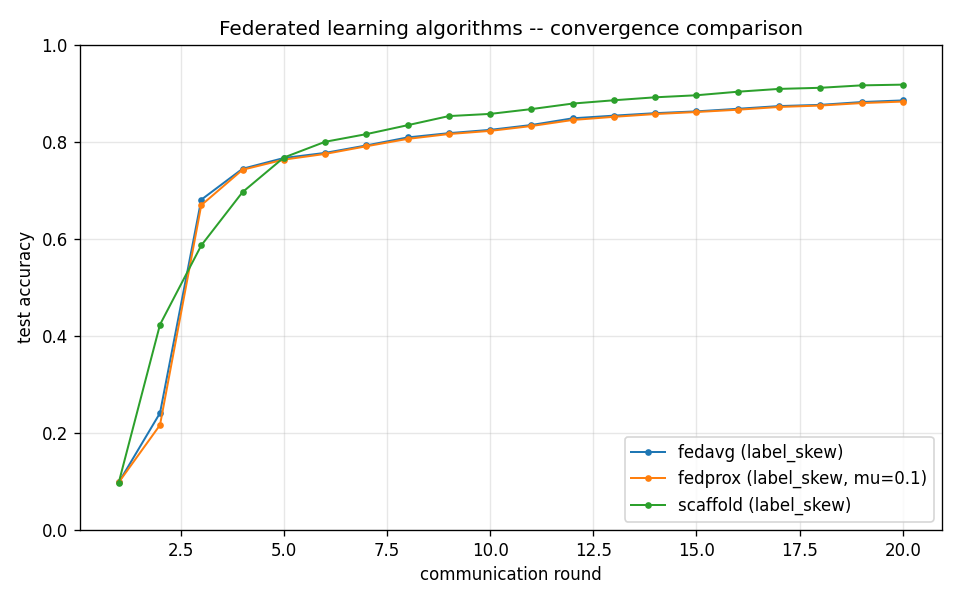

# Three-way algorithm comparison

## Runs

| Run | Algorithm | Partition | Rounds | Final acc | Best acc | Round to 0.90 |
|---|---|---|---|---|---|---|
| fedavg_labelskew_2_K100 | fedavg | label_skew | 20 | 0.8854 | 0.8854 | - |
| fedprox_labelskew_2_K100_mu0.1 | fedprox | label_skew | 20 | 0.8830 | 0.8830 | - |
| scaffold_labelskew_2_K100 | scaffold | label_skew | 20 | 0.9179 | 0.9179 | 16 |

## Observations

These runs use label_skew(2 of 10 classes) with **100 clients, full
participation**, 5 local epochs, 20 rounds. Compare against the K=10
label_skew(2) sweep (`LABELSKEW_REPORT.md`):

| Algorithm        | K=10 final | K=100 final |
|------------------|-----------|-------------|
| FedAvg           | 0.8219    | 0.8854      |
| FedProx (mu=0.1) | 0.8024    | 0.8830      |
| SCAFFOLD         | 0.6856    | **0.9179**  |

- **SCAFFOLD reverses from worst to best as client count grows.** At
  K=10 SCAFFOLD trails FedAvg by 14 pp (0.686 vs 0.822); at K=100 it
  leads by 3 pp (0.918 vs 0.885) and is the only algorithm to cross
  0.90 (round 16). SCAFFOLD's control variates estimate the
  client-vs-global gradient direction. With only 10 severely-skewed
  clients each control variate is estimated from a tiny, biased slice,
  so the correction injects more noise than signal. At 100 clients the
  *server* control variate `c` averages 100 noisy client variates, and
  that average is a far better estimate of the true global direction --
  exactly the variance-reduction regime SCAFFOLD was designed for.
- **FedProx mu=0.1 stops hurting at scale.** At K=10 the strong
  proximal anchor cost 2 pp vs FedAvg (over-anchoring to a global model
  that is itself drifting); at K=100 the global model is more stable,
  so the anchor is neutral (0.883 vs 0.885).
- **FedAvg itself improves with more clients** (0.822 -> 0.885):
  averaging 100 biased updates per round cancels more of the per-client
  skew than averaging 10 does.
- Plot accuracy vs *round*, not wall-clock: SCAFFOLD pays ~2x
  communication per round (it ships control variates alongside
  weights) in return for the higher final accuracy shown here.

See [design-decisions.md](../docs/design-decisions.md) D10 for the
takeaway: drift-correction algorithms are sensitive to the
client-count regime, and a single small-scale experiment can rank them
backwards.
