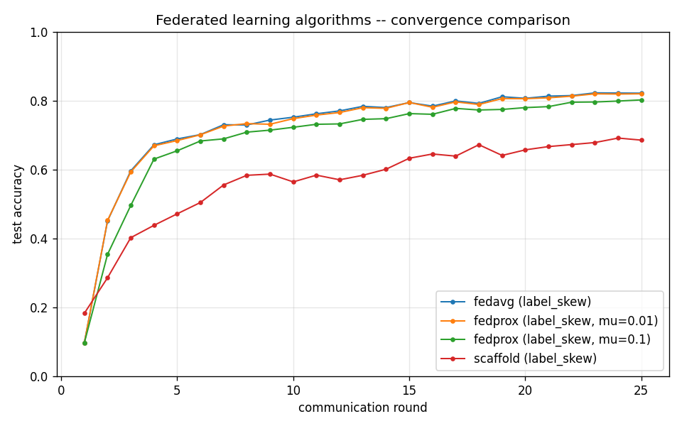

# Three-way algorithm comparison

## Runs

| Run | Algorithm | Partition | Rounds | Final acc | Best acc | Round to 0.90 |
|---|---|---|---|---|---|---|
| fedavg_labelskew_2 | fedavg | label_skew | 25 | 0.8219 | 0.8228 | - |
| fedprox_labelskew_2_mu0.01 | fedprox | label_skew | 25 | 0.8201 | 0.8201 | - |
| fedprox_labelskew_2_mu0.1 | fedprox | label_skew | 25 | 0.8024 | 0.8024 | - |
| scaffold_labelskew_2 | scaffold | label_skew | 25 | 0.6856 | 0.6916 | - |

## Observations

- For Non-IID partitions (Dirichlet alpha=0.1), FedAvg drifts; FedProx
  anchors via the proximal term (mu); SCAFFOLD corrects drift via
  control variates.
- Plot accuracy vs *round*, not wall-clock: SCAFFOLD pays ~2x
  communication per round in return for fewer rounds to a target.
