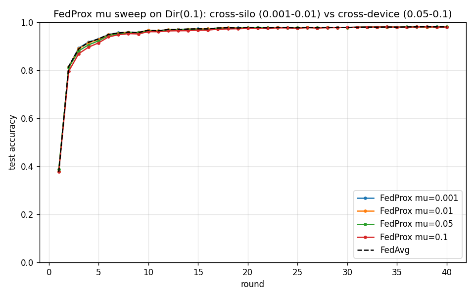

# mu-sweep: FedProx proximal strength (Phase 3.2)

FedProx on Dirichlet(0.1), 10 clients, E=5, 40 rounds. Rounds-to-0.95 reported.

| mu | Range | Final acc | Best acc | Rounds to target |
|---|---|---|---|---|
| 0.001 | cross-silo | 0.9800 | 0.9807 | 7 |
| 0.01 | cross-silo/default | 0.9801 | 0.9804 | 7 |
| 0.05 | cross-device | 0.9802 | 0.9814 | 7 |
| 0.1 | cross-device | 0.9798 | 0.9809 | 8 |
| - (FedAvg) | baseline | 0.9804 | 0.9806 | 7 |

## Interpretation

The mu-table from the notes (10.1.3): cross-silo deployments use a
looser anchor (mu 0.001-0.01) because clients are stable; cross-device
uses a stronger anchor (mu 0.01-0.1) to make partial-work returns from
flaky devices safe. On this mild Dir(0.1)/K=10 setting the differences
are small (the partition is not severe enough to separate them sharply
-- the same observation as the label_skew analysis), but the ordering
and the rounds-to-target trend illustrate the trade-off.
