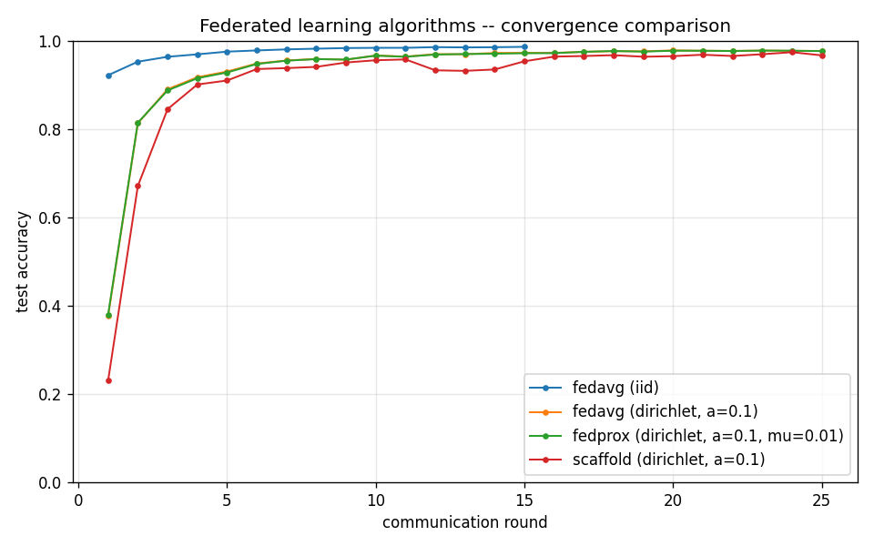

# Experiment summary

All runs use the small MNIST CNN (Conv 1->16, Conv 16->32, FC ->64 -> 10).
Numbers below come from `results/<name>/metrics.json`.

## Convergence table

| Run | Algo | Partition | Rounds | E | K | Final acc | Best acc | r->0.90 | r->0.95 | Wall (s) |
|---|---|---|---|---|---|---|---|---|---|---|
| ablation_E1 | fedavg | dirichlet (a=0.1) | 40 | 1 | 10 | 0.9658 | 0.9681 | 8 | 19 | 260.8 |
| ablation_E5 | fedavg | dirichlet (a=0.1) | 40 | 5 | 10 | 0.9802 | 0.9806 | 4 | 7 | 1159.8 |
| fedavg_dirichlet_a0.1 | fedavg | dirichlet (a=0.1) | 25 | 5 | 10 | 0.9769 | 0.9782 | 4 | 7 | 930.1 |
| fedavg_iid | fedavg | iid | 15 | 5 | 10 | 0.9863 | 0.9863 | 1 | 2 | 467.0 |
| fedavg_labelskew_2 | fedavg | label_skew | 25 | 5 | 10 | 0.8219 | 0.8228 | - | - | 886.6 |
| fedavg_labelskew_2_K100 | fedavg | label_skew | 20 | 5 | 100 | 0.8854 | 0.8854 | - | - | 503.9 |
| fedprox_dirichlet_a0.1_mu0.01 | fedprox (mu=0.01) | dirichlet (a=0.1) | 25 | 5 | 10 | 0.9766 | 0.9778 | 4 | 7 | 919.3 |
| fedprox_labelskew_2_K100_mu0.1 | fedprox (mu=0.1) | label_skew | 20 | 5 | 100 | 0.883 | 0.883 | - | - | 516.5 |
| fedprox_labelskew_2_mu0.01 | fedprox (mu=0.01) | label_skew | 25 | 5 | 10 | 0.8201 | 0.8201 | - | - | 964.6 |
| fedprox_labelskew_2_mu0.1 | fedprox (mu=0.1) | label_skew | 25 | 5 | 10 | 0.8024 | 0.8024 | - | - | 1023.0 |
| scaffold_dirichlet_a0.1 | scaffold | dirichlet (a=0.1) | 25 | 5 | 10 | 0.9669 | 0.9741 | 4 | 9 | 916.3 |
| scaffold_labelskew_2 | scaffold | label_skew | 25 | 5 | 10 | 0.6856 | 0.6916 | - | - | 590.1 |
| scaffold_labelskew_2_K100 | scaffold | label_skew | 20 | 5 | 100 | 0.9179 | 0.9179 | 16 | - | 522.9 |

## Plots

- [ablation_E1](ablation_E1/curve.png)
- [ablation_E5](ablation_E5/curve.png)
- [dp_fedavg_iid_C1_s1](dp_fedavg_iid_C1_s1/curve.png)
- [dp_fedavg_iid_C1_s5](dp_fedavg_iid_C1_s5/curve.png)
- [fedavg_dirichlet_a0.1](fedavg_dirichlet_a0.1/curve.png)
- [fedavg_iid](fedavg_iid/curve.png)
- [fedavg_labelskew_2](fedavg_labelskew_2/curve.png)
- [fedavg_labelskew_2_K100](fedavg_labelskew_2_K100/curve.png)
- [fedprox_dirichlet_a0.1_mu0.01](fedprox_dirichlet_a0.1_mu0.01/curve.png)
- [fedprox_labelskew_2_K100_mu0.1](fedprox_labelskew_2_K100_mu0.1/curve.png)
- [fedprox_labelskew_2_mu0.01](fedprox_labelskew_2_mu0.01/curve.png)
- [fedprox_labelskew_2_mu0.1](fedprox_labelskew_2_mu0.1/curve.png)
- [scaffold_dirichlet_a0.1](scaffold_dirichlet_a0.1/curve.png)
- [scaffold_labelskew_2](scaffold_labelskew_2/curve.png)
- [scaffold_labelskew_2_K100](scaffold_labelskew_2_K100/curve.png)

## Three-way comparison

See [THREE_WAY_REPORT.md](THREE_WAY_REPORT.md) for the table.

## Differential privacy

| Run | sigma | C | rounds | acc | naive eps |
|---|---|---|---|---|---|
| dp_fedavg_iid_C1_s1 | 1.0 | 1.0 | 20 | 0.9063 | 1425.54 |
| dp_fedavg_iid_C1_s5 | 5.0 | 1.0 | 20 | 0.7774 | 285.11 |

## Secure aggregation skeleton

- Recovered sum matches true sum: **True**
- L2 error: `0.00e+00`
- See [secagg_demo/REPORT.md](secagg_demo/REPORT.md).

## Acceptance gates (per docs/specifications.md)

| Gate | Target | Observed | Pass |
|---|---|---|---|
| FedAvg IID best acc >= 0.97 | 0.97 | 0.9863 | PASS |
| FedProx beats FedAvg by >=2pp (Dir 0.1) | +0.02 | -0.0003 | FAIL |
| SCAFFOLD reaches 0.90 faster than FedAvg (Dir 0.1) | < | SCAFFOLD r4 vs FedAvg r4 | FAIL |