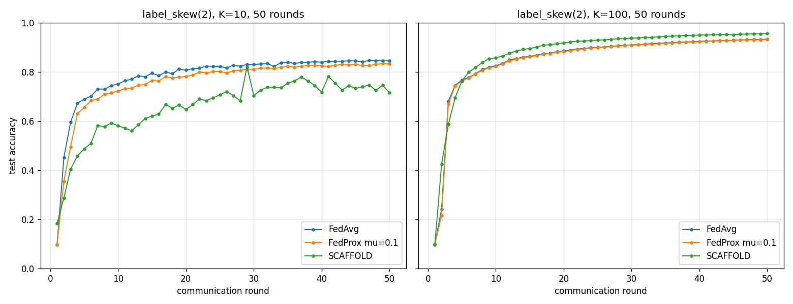

# Unified-round label_skew comparison (50 rounds, apples-to-apples)

Same round budget (50) and seed (0) for every run, so K=10 and
K=100 are directly comparable and every algorithm is run to a
plateau. Supersedes the earlier mixed-budget sweep (25 vs 20).

| K | Algorithm | Final acc | Best acc | r->0.90 | Plateaued? | mean|d| last5 |
|---|---|---|---|---|---|---|
| 10 | FedAvg | 0.8442 | 0.8463 | - | yes | 0.19pp |
| 10 | FedProx mu=0.1 | 0.8320 | 0.8339 | - | yes | 0.26pp |
| 10 | SCAFFOLD | 0.7155 | 0.8210 | - | NO | 1.97pp |
| 100 | FedAvg | 0.9327 | 0.9327 | 26 | yes | 0.07pp |
| 100 | FedProx mu=0.1 | 0.9315 | 0.9315 | 26 | yes | 0.06pp |
| 100 | SCAFFOLD | 0.9562 | 0.9562 | 16 | yes | 0.07pp |

## Convergence verdict

A run is 'plateaued' if the mean absolute round-to-round accuracy
change over the last 5 rounds is < 0.5pp. Only
plateaued numbers are reported as converged values.
