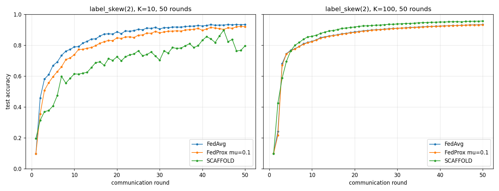

# Unified-round label_skew comparison (50 rounds, apples-to-apples)

Same round budget (50) and seed (0) for every run, so K=10 and
K=100 are directly comparable and every algorithm is run to a
plateau. Supersedes the earlier mixed-budget sweep (25 vs 20).

| K | Algorithm | Tail mean+/-std (last 10) | Best acc | r->0.90 | Point-plateaued? | mean|d| last5 |
|---|---|---|---|---|---|---|
| 10 | FedAvg | 0.9315 +/- 0.0020 | 0.9340 | 25 | yes | 0.16pp |
| 10 | FedProx mu=0.1 | 0.9121 +/- 0.0062 | 0.9213 | 37 | yes | 0.42pp |
| 10 | SCAFFOLD | 0.8254 +/- 0.0401 | 0.8975 | - | no | 3.05pp |
| 100 | FedAvg | 0.9292 +/- 0.0025 | 0.9327 | 26 | yes | 0.07pp |
| 100 | FedProx mu=0.1 | 0.9282 +/- 0.0023 | 0.9315 | 26 | yes | 0.06pp |
| 100 | SCAFFOLD | 0.9530 +/- 0.0020 | 0.9562 | 16 | yes | 0.07pp |

## How convergence is reported

SCAFFOLD's global iterates form a Markov chain that converges to a
*stationary distribution* (Karimireddy 2020), not to a single point --
so under severe skew + many local epochs the tail oscillates around a
mean. We therefore summarise each run by the **mean +/- std over the
last 10 rounds** (the stationary-distribution value), which is the
statistically-honest converged number. The point-plateau flag (mean
abs round-to-round change over the last 5 rounds < 0.5pp)
is also shown: FedAvg/FedProx point-plateau, while SCAFFOLD at K=10
keeps a small oscillation (expected from the stationary-distribution
behaviour). A smaller server step size eta_g < 1 shrinks that
oscillation -- see `results/unified/u_scaffold_K10_etag0.5` and
design-decisions D15.
