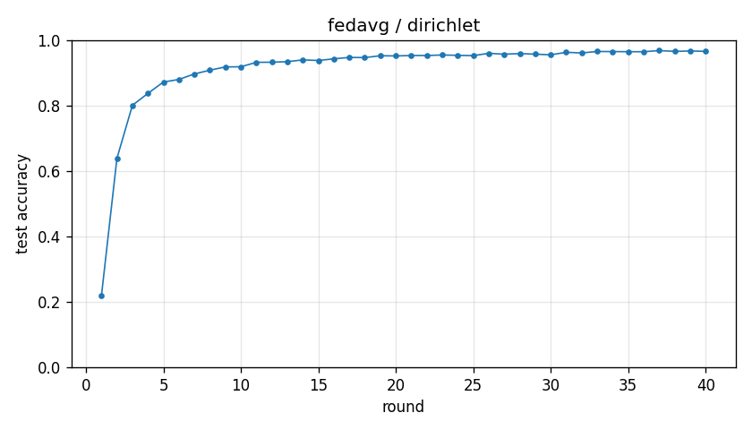

# Experiment report -- fedavg / dirichlet

## Configuration

| Key | Value |
|---|---|
| algorithm | fedavg |
| partition | dirichlet |
| num_clients | 10 |
| classes_per_client | 2 |
| alpha | 0.1 |
| rounds | 40 |
| local_epochs | 1 |
| local_lr | 0.01 |
| batch_size | 64 |
| participation_rate | 1.0 |
| mu | 0.01 |
| seed | 0 |
| device | cuda |
| output_dir | results/ablation_E1 |
| log_every | 1 |

## Partition

- Number of clients with data: **10**
- Samples per client: min=1973, median=5237, max=16224, total=60000

## Results

- Final test accuracy (round 40): **0.9658**
- Best test accuracy: **0.9681** at round 37
- Final test loss: 0.1039
- Rounds to 0.90 acc: 8
- Rounds to 0.95 acc: 19
- Wall clock: 260.8s

## Per-round history

| Round | Test acc | Test loss | Clients |
|---|---|---|---|
| 1 | 0.2180 | 2.0166 | 10 |
| 2 | 0.6384 | 1.1876 | 10 |
| 3 | 0.8008 | 0.7420 | 10 |
| 4 | 0.8372 | 0.5467 | 10 |
| 5 | 0.8720 | 0.4526 | 10 |
| 6 | 0.8798 | 0.3988 | 10 |
| 7 | 0.8967 | 0.3489 | 10 |
| 8 | 0.9081 | 0.3098 | 10 |
| 9 | 0.9181 | 0.2812 | 10 |
| 10 | 0.9186 | 0.2709 | 10 |
| 11 | 0.9322 | 0.2404 | 10 |
| 12 | 0.9325 | 0.2262 | 10 |
| 13 | 0.9342 | 0.2157 | 10 |
| 14 | 0.9396 | 0.2008 | 10 |
| 15 | 0.9378 | 0.1990 | 10 |
| 16 | 0.9428 | 0.1843 | 10 |
| 17 | 0.9472 | 0.1755 | 10 |
| 18 | 0.9466 | 0.1694 | 10 |
| 19 | 0.9523 | 0.1586 | 10 |
| 20 | 0.9517 | 0.1533 | 10 |
| 21 | 0.9530 | 0.1506 | 10 |
| 22 | 0.9531 | 0.1476 | 10 |
| 23 | 0.9546 | 0.1431 | 10 |
| 24 | 0.9536 | 0.1421 | 10 |
| 25 | 0.9526 | 0.1435 | 10 |
| 26 | 0.9597 | 0.1268 | 10 |
| 27 | 0.9570 | 0.1311 | 10 |
| 28 | 0.9589 | 0.1278 | 10 |
| 29 | 0.9571 | 0.1319 | 10 |
| 30 | 0.9552 | 0.1344 | 10 |
| 31 | 0.9628 | 0.1167 | 10 |
| 32 | 0.9608 | 0.1183 | 10 |
| 33 | 0.9654 | 0.1064 | 10 |
| 34 | 0.9650 | 0.1084 | 10 |
| 35 | 0.9647 | 0.1074 | 10 |
| 36 | 0.9645 | 0.1079 | 10 |
| 37 | 0.9681 | 0.0994 | 10 |
| 38 | 0.9656 | 0.1039 | 10 |
| 39 | 0.9668 | 0.1002 | 10 |
| 40 | 0.9658 | 0.1039 | 10 |

