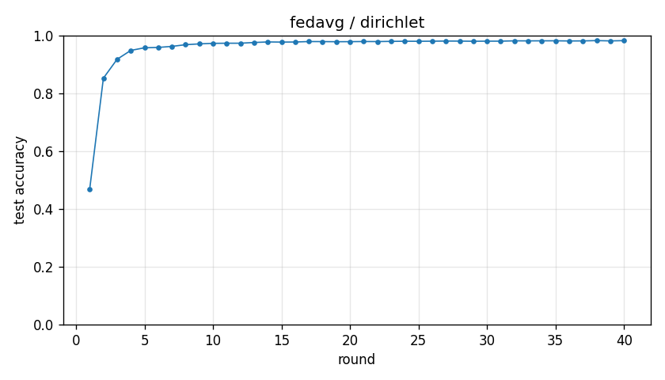

# Experiment report -- fedavg / dirichlet

## Configuration

| Key | Value |
|---|---|
| algorithm | fedavg |
| partition | dirichlet |
| num_clients | 10 |
| classes_per_client | 2 |
| alpha | 0.1 |
| rounds | 40 |
| local_epochs | 10 |
| local_lr | 0.01 |
| batch_size | 64 |
| participation_rate | 1.0 |
| mu | 0.01 |
| seed | 0 |
| device | cuda |
| output_dir | results/ablation_E10 |
| log_every | 1 |

## Partition

- Number of clients with data: **10**
- Samples per client: min=1973, median=5237, max=16224, total=60000

## Results

- Final test accuracy (round 40): **0.9822**
- Best test accuracy: **0.9823** at round 38
- Final test loss: 0.0590
- Rounds to 0.90 acc: 3
- Rounds to 0.95 acc: 5
- Wall clock: 2232.2s

## Per-round history

| Round | Test acc | Test loss | Clients |
|---|---|---|---|
| 1 | 0.4683 | 1.3867 | 10 |
| 2 | 0.8523 | 0.4549 | 10 |
| 3 | 0.9176 | 0.2495 | 10 |
| 4 | 0.9483 | 0.1628 | 10 |
| 5 | 0.9574 | 0.1315 | 10 |
| 6 | 0.9586 | 0.1244 | 10 |
| 7 | 0.9622 | 0.1126 | 10 |
| 8 | 0.9681 | 0.0966 | 10 |
| 9 | 0.9709 | 0.0868 | 10 |
| 10 | 0.9727 | 0.0830 | 10 |
| 11 | 0.9732 | 0.0801 | 10 |
| 12 | 0.9732 | 0.0793 | 10 |
| 13 | 0.9757 | 0.0730 | 10 |
| 14 | 0.9776 | 0.0732 | 10 |
| 15 | 0.9771 | 0.0703 | 10 |
| 16 | 0.9774 | 0.0688 | 10 |
| 17 | 0.9790 | 0.0656 | 10 |
| 18 | 0.9788 | 0.0644 | 10 |
| 19 | 0.9784 | 0.0655 | 10 |
| 20 | 0.9786 | 0.0648 | 10 |
| 21 | 0.9791 | 0.0636 | 10 |
| 22 | 0.9789 | 0.0651 | 10 |
| 23 | 0.9796 | 0.0634 | 10 |
| 24 | 0.9800 | 0.0634 | 10 |
| 25 | 0.9799 | 0.0630 | 10 |
| 26 | 0.9802 | 0.0628 | 10 |
| 27 | 0.9807 | 0.0619 | 10 |
| 28 | 0.9805 | 0.0627 | 10 |
| 29 | 0.9800 | 0.0622 | 10 |
| 30 | 0.9803 | 0.0621 | 10 |
| 31 | 0.9803 | 0.0622 | 10 |
| 32 | 0.9815 | 0.0596 | 10 |
| 33 | 0.9813 | 0.0594 | 10 |
| 34 | 0.9815 | 0.0589 | 10 |
| 35 | 0.9816 | 0.0597 | 10 |
| 36 | 0.9810 | 0.0606 | 10 |
| 37 | 0.9812 | 0.0609 | 10 |
| 38 | 0.9823 | 0.0594 | 10 |
| 39 | 0.9812 | 0.0604 | 10 |
| 40 | 0.9822 | 0.0590 | 10 |

