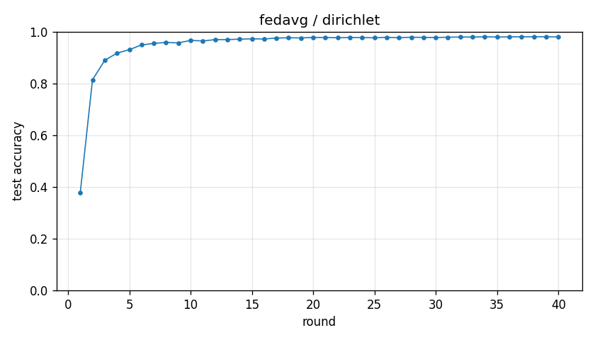

# Experiment report -- fedavg / dirichlet

## Configuration

| Key | Value |
|---|---|
| algorithm | fedavg |
| partition | dirichlet |
| num_clients | 10 |
| classes_per_client | 2 |
| alpha | 0.1 |
| rounds | 40 |
| local_epochs | 5 |
| local_lr | 0.01 |
| batch_size | 64 |
| participation_rate | 1.0 |
| mu | 0.01 |
| seed | 0 |
| device | cuda |
| output_dir | results/ablation_E5 |
| log_every | 1 |

## Partition

- Number of clients with data: **10**
- Samples per client: min=1973, median=5237, max=16224, total=60000

## Results

- Final test accuracy (round 40): **0.9802**
- Best test accuracy: **0.9806** at round 34
- Final test loss: 0.0619
- Rounds to 0.90 acc: 4
- Rounds to 0.95 acc: 7
- Wall clock: 1159.8s

## Per-round history

| Round | Test acc | Test loss | Clients |
|---|---|---|---|
| 1 | 0.3773 | 1.6365 | 10 |
| 2 | 0.8143 | 0.5900 | 10 |
| 3 | 0.8895 | 0.3423 | 10 |
| 4 | 0.9174 | 0.2567 | 10 |
| 5 | 0.9306 | 0.2103 | 10 |
| 6 | 0.9490 | 0.1622 | 10 |
| 7 | 0.9550 | 0.1364 | 10 |
| 8 | 0.9587 | 0.1247 | 10 |
| 9 | 0.9568 | 0.1269 | 10 |
| 10 | 0.9665 | 0.1031 | 10 |
| 11 | 0.9644 | 0.1043 | 10 |
| 12 | 0.9695 | 0.0932 | 10 |
| 13 | 0.9696 | 0.0921 | 10 |
| 14 | 0.9714 | 0.0881 | 10 |
| 15 | 0.9725 | 0.0861 | 10 |
| 16 | 0.9720 | 0.0856 | 10 |
| 17 | 0.9757 | 0.0801 | 10 |
| 18 | 0.9767 | 0.0754 | 10 |
| 19 | 0.9761 | 0.0766 | 10 |
| 20 | 0.9779 | 0.0711 | 10 |
| 21 | 0.9775 | 0.0730 | 10 |
| 22 | 0.9768 | 0.0731 | 10 |
| 23 | 0.9779 | 0.0689 | 10 |
| 24 | 0.9774 | 0.0702 | 10 |
| 25 | 0.9766 | 0.0705 | 10 |
| 26 | 0.9785 | 0.0658 | 10 |
| 27 | 0.9768 | 0.0694 | 10 |
| 28 | 0.9789 | 0.0651 | 10 |
| 29 | 0.9781 | 0.0672 | 10 |
| 30 | 0.9776 | 0.0670 | 10 |
| 31 | 0.9789 | 0.0632 | 10 |
| 32 | 0.9796 | 0.0622 | 10 |
| 33 | 0.9794 | 0.0626 | 10 |
| 34 | 0.9806 | 0.0611 | 10 |
| 35 | 0.9795 | 0.0635 | 10 |
| 36 | 0.9801 | 0.0615 | 10 |
| 37 | 0.9805 | 0.0610 | 10 |
| 38 | 0.9806 | 0.0600 | 10 |
| 39 | 0.9805 | 0.0611 | 10 |
| 40 | 0.9802 | 0.0619 | 10 |

