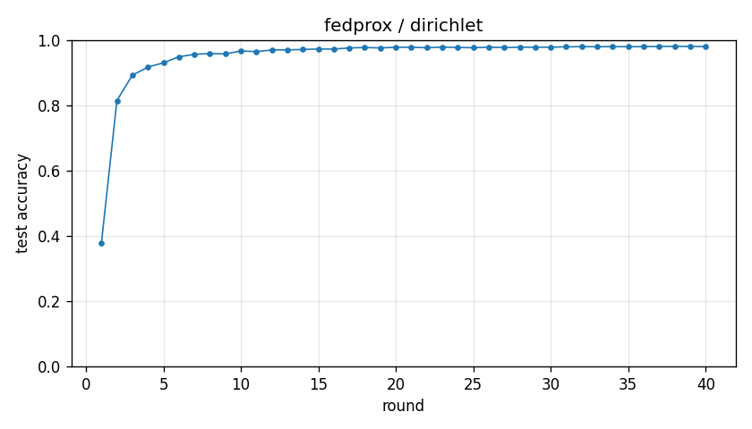

# Experiment report -- fedprox / dirichlet

## Configuration

| Key | Value |
|---|---|
| algorithm | fedprox |
| partition | dirichlet |
| num_clients | 10 |
| classes_per_client | 2 |
| alpha | 0.1 |
| rounds | 40 |
| local_epochs | 5 |
| local_lr | 0.01 |
| batch_size | 64 |
| participation_rate | 1.0 |
| mu | 0.001 |
| seed | 0 |
| device | cuda |
| output_dir | results/ablation_mu0.001 |
| log_every | 1 |

## Partition

- Number of clients with data: **10**
- Samples per client: min=1973, median=5237, max=16224, total=60000

## Results

- Final test accuracy (round 40): **0.9800**
- Best test accuracy: **0.9807** at round 38
- Final test loss: 0.0617
- Rounds to 0.90 acc: 4
- Rounds to 0.95 acc: 7
- Wall clock: 1142.6s

## Per-round history

| Round | Test acc | Test loss | Clients |
|---|---|---|---|
| 1 | 0.3784 | 1.6357 | 10 |
| 2 | 0.8146 | 0.5895 | 10 |
| 3 | 0.8924 | 0.3384 | 10 |
| 4 | 0.9172 | 0.2569 | 10 |
| 5 | 0.9302 | 0.2112 | 10 |
| 6 | 0.9488 | 0.1627 | 10 |
| 7 | 0.9560 | 0.1361 | 10 |
| 8 | 0.9587 | 0.1250 | 10 |
| 9 | 0.9574 | 0.1264 | 10 |
| 10 | 0.9667 | 0.1032 | 10 |
| 11 | 0.9644 | 0.1042 | 10 |
| 12 | 0.9696 | 0.0932 | 10 |
| 13 | 0.9699 | 0.0917 | 10 |
| 14 | 0.9711 | 0.0881 | 10 |
| 15 | 0.9725 | 0.0861 | 10 |
| 16 | 0.9723 | 0.0856 | 10 |
| 17 | 0.9758 | 0.0801 | 10 |
| 18 | 0.9771 | 0.0752 | 10 |
| 19 | 0.9759 | 0.0768 | 10 |
| 20 | 0.9779 | 0.0713 | 10 |
| 21 | 0.9780 | 0.0732 | 10 |
| 22 | 0.9765 | 0.0735 | 10 |
| 23 | 0.9785 | 0.0688 | 10 |
| 24 | 0.9774 | 0.0703 | 10 |
| 25 | 0.9765 | 0.0704 | 10 |
| 26 | 0.9782 | 0.0654 | 10 |
| 27 | 0.9770 | 0.0695 | 10 |
| 28 | 0.9782 | 0.0652 | 10 |
| 29 | 0.9781 | 0.0669 | 10 |
| 30 | 0.9781 | 0.0661 | 10 |
| 31 | 0.9792 | 0.0628 | 10 |
| 32 | 0.9798 | 0.0620 | 10 |
| 33 | 0.9795 | 0.0621 | 10 |
| 34 | 0.9799 | 0.0605 | 10 |
| 35 | 0.9795 | 0.0633 | 10 |
| 36 | 0.9798 | 0.0612 | 10 |
| 37 | 0.9804 | 0.0606 | 10 |
| 38 | 0.9807 | 0.0595 | 10 |
| 39 | 0.9804 | 0.0605 | 10 |
| 40 | 0.9800 | 0.0617 | 10 |

