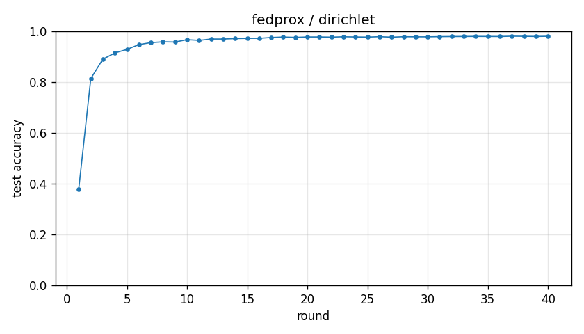

# Experiment report -- fedprox / dirichlet

## Configuration

| Key | Value |
|---|---|
| algorithm | fedprox |
| partition | dirichlet |
| num_clients | 10 |
| classes_per_client | 2 |
| alpha | 0.1 |
| rounds | 40 |
| local_epochs | 5 |
| local_lr | 0.01 |
| batch_size | 64 |
| participation_rate | 1.0 |
| mu | 0.01 |
| seed | 0 |
| device | cuda |
| output_dir | results/ablation_mu0.01 |
| log_every | 1 |

## Partition

- Number of clients with data: **10**
- Samples per client: min=1973, median=5237, max=16224, total=60000

## Results

- Final test accuracy (round 40): **0.9801**
- Best test accuracy: **0.9804** at round 37
- Final test loss: 0.0618
- Rounds to 0.90 acc: 4
- Rounds to 0.95 acc: 7
- Wall clock: 1029.1s

## Per-round history

| Round | Test acc | Test loss | Clients |
|---|---|---|---|
| 1 | 0.3791 | 1.6502 | 10 |
| 2 | 0.8133 | 0.6044 | 10 |
| 3 | 0.8896 | 0.3480 | 10 |
| 4 | 0.9142 | 0.2641 | 10 |
| 5 | 0.9281 | 0.2161 | 10 |
| 6 | 0.9473 | 0.1669 | 10 |
| 7 | 0.9550 | 0.1397 | 10 |
| 8 | 0.9581 | 0.1281 | 10 |
| 9 | 0.9573 | 0.1284 | 10 |
| 10 | 0.9666 | 0.1052 | 10 |
| 11 | 0.9638 | 0.1059 | 10 |
| 12 | 0.9691 | 0.0944 | 10 |
| 13 | 0.9691 | 0.0931 | 10 |
| 14 | 0.9709 | 0.0895 | 10 |
| 15 | 0.9717 | 0.0871 | 10 |
| 16 | 0.9719 | 0.0860 | 10 |
| 17 | 0.9752 | 0.0812 | 10 |
| 18 | 0.9770 | 0.0762 | 10 |
| 19 | 0.9756 | 0.0777 | 10 |
| 20 | 0.9773 | 0.0725 | 10 |
| 21 | 0.9773 | 0.0737 | 10 |
| 22 | 0.9766 | 0.0738 | 10 |
| 23 | 0.9781 | 0.0696 | 10 |
| 24 | 0.9773 | 0.0709 | 10 |
| 25 | 0.9768 | 0.0709 | 10 |
| 26 | 0.9784 | 0.0663 | 10 |
| 27 | 0.9765 | 0.0700 | 10 |
| 28 | 0.9783 | 0.0662 | 10 |
| 29 | 0.9779 | 0.0674 | 10 |
| 30 | 0.9778 | 0.0668 | 10 |
| 31 | 0.9787 | 0.0634 | 10 |
| 32 | 0.9791 | 0.0630 | 10 |
| 33 | 0.9793 | 0.0627 | 10 |
| 34 | 0.9796 | 0.0614 | 10 |
| 35 | 0.9794 | 0.0635 | 10 |
| 36 | 0.9792 | 0.0616 | 10 |
| 37 | 0.9804 | 0.0610 | 10 |
| 38 | 0.9800 | 0.0599 | 10 |
| 39 | 0.9794 | 0.0610 | 10 |
| 40 | 0.9801 | 0.0618 | 10 |

