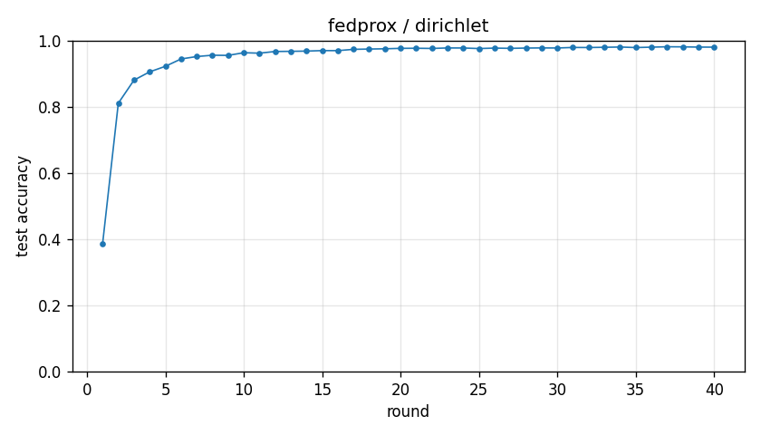

# Experiment report -- fedprox / dirichlet

## Configuration

| Key | Value |
|---|---|
| algorithm | fedprox |
| partition | dirichlet |
| num_clients | 10 |
| classes_per_client | 2 |
| alpha | 0.1 |
| rounds | 40 |
| local_epochs | 5 |
| local_lr | 0.01 |
| batch_size | 64 |
| participation_rate | 1.0 |
| mu | 0.05 |
| seed | 0 |
| device | cuda |
| output_dir | results/ablation_mu0.05 |
| log_every | 1 |

## Partition

- Number of clients with data: **10**
- Samples per client: min=1973, median=5237, max=16224, total=60000

## Results

- Final test accuracy (round 40): **0.9802**
- Best test accuracy: **0.9814** at round 37
- Final test loss: 0.0614
- Rounds to 0.90 acc: 4
- Rounds to 0.95 acc: 7
- Wall clock: 1013.7s

## Per-round history

| Round | Test acc | Test loss | Clients |
|---|---|---|---|
| 1 | 0.3870 | 1.7038 | 10 |
| 2 | 0.8108 | 0.6660 | 10 |
| 3 | 0.8806 | 0.3882 | 10 |
| 4 | 0.9056 | 0.2925 | 10 |
| 5 | 0.9223 | 0.2378 | 10 |
| 6 | 0.9445 | 0.1821 | 10 |
| 7 | 0.9518 | 0.1541 | 10 |
| 8 | 0.9558 | 0.1385 | 10 |
| 9 | 0.9553 | 0.1357 | 10 |
| 10 | 0.9634 | 0.1126 | 10 |
| 11 | 0.9620 | 0.1130 | 10 |
| 12 | 0.9671 | 0.1003 | 10 |
| 13 | 0.9676 | 0.0988 | 10 |
| 14 | 0.9683 | 0.0961 | 10 |
| 15 | 0.9698 | 0.0922 | 10 |
| 16 | 0.9697 | 0.0910 | 10 |
| 17 | 0.9736 | 0.0853 | 10 |
| 18 | 0.9745 | 0.0794 | 10 |
| 19 | 0.9753 | 0.0808 | 10 |
| 20 | 0.9766 | 0.0755 | 10 |
| 21 | 0.9769 | 0.0759 | 10 |
| 22 | 0.9763 | 0.0762 | 10 |
| 23 | 0.9778 | 0.0714 | 10 |
| 24 | 0.9777 | 0.0725 | 10 |
| 25 | 0.9760 | 0.0719 | 10 |
| 26 | 0.9774 | 0.0672 | 10 |
| 27 | 0.9766 | 0.0707 | 10 |
| 28 | 0.9775 | 0.0696 | 10 |
| 29 | 0.9779 | 0.0687 | 10 |
| 30 | 0.9777 | 0.0667 | 10 |
| 31 | 0.9793 | 0.0637 | 10 |
| 32 | 0.9791 | 0.0634 | 10 |
| 33 | 0.9798 | 0.0626 | 10 |
| 34 | 0.9806 | 0.0610 | 10 |
| 35 | 0.9790 | 0.0641 | 10 |
| 36 | 0.9802 | 0.0614 | 10 |
| 37 | 0.9814 | 0.0609 | 10 |
| 38 | 0.9811 | 0.0594 | 10 |
| 39 | 0.9804 | 0.0611 | 10 |
| 40 | 0.9802 | 0.0614 | 10 |

