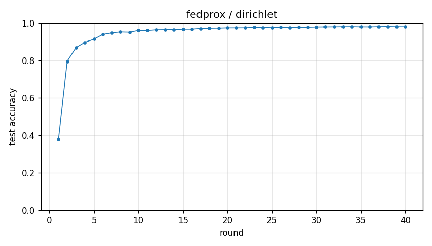

# Experiment report -- fedprox / dirichlet

## Configuration

| Key | Value |
|---|---|
| algorithm | fedprox |
| partition | dirichlet |
| num_clients | 10 |
| classes_per_client | 2 |
| alpha | 0.1 |
| rounds | 40 |
| local_epochs | 5 |
| local_lr | 0.01 |
| batch_size | 64 |
| participation_rate | 1.0 |
| mu | 0.1 |
| seed | 0 |
| device | cuda |
| output_dir | results/ablation_mu0.1 |
| log_every | 1 |

## Partition

- Number of clients with data: **10**
- Samples per client: min=1973, median=5237, max=16224, total=60000

## Results

- Final test accuracy (round 40): **0.9798**
- Best test accuracy: **0.9809** at round 38
- Final test loss: 0.0638
- Rounds to 0.90 acc: 5
- Rounds to 0.95 acc: 8
- Wall clock: 1070.5s

## Per-round history

| Round | Test acc | Test loss | Clients |
|---|---|---|---|
| 1 | 0.3769 | 1.7451 | 10 |
| 2 | 0.7954 | 0.7450 | 10 |
| 3 | 0.8687 | 0.4348 | 10 |
| 4 | 0.8962 | 0.3265 | 10 |
| 5 | 0.9138 | 0.2665 | 10 |
| 6 | 0.9388 | 0.2033 | 10 |
| 7 | 0.9477 | 0.1724 | 10 |
| 8 | 0.9522 | 0.1545 | 10 |
| 9 | 0.9510 | 0.1489 | 10 |
| 10 | 0.9603 | 0.1245 | 10 |
| 11 | 0.9600 | 0.1238 | 10 |
| 12 | 0.9636 | 0.1099 | 10 |
| 13 | 0.9642 | 0.1092 | 10 |
| 14 | 0.9644 | 0.1057 | 10 |
| 15 | 0.9668 | 0.1007 | 10 |
| 16 | 0.9671 | 0.0982 | 10 |
| 17 | 0.9707 | 0.0908 | 10 |
| 18 | 0.9719 | 0.0854 | 10 |
| 19 | 0.9726 | 0.0861 | 10 |
| 20 | 0.9739 | 0.0804 | 10 |
| 21 | 0.9740 | 0.0806 | 10 |
| 22 | 0.9743 | 0.0818 | 10 |
| 23 | 0.9762 | 0.0762 | 10 |
| 24 | 0.9760 | 0.0767 | 10 |
| 25 | 0.9748 | 0.0754 | 10 |
| 26 | 0.9771 | 0.0711 | 10 |
| 27 | 0.9756 | 0.0738 | 10 |
| 28 | 0.9769 | 0.0739 | 10 |
| 29 | 0.9771 | 0.0719 | 10 |
| 30 | 0.9785 | 0.0694 | 10 |
| 31 | 0.9790 | 0.0656 | 10 |
| 32 | 0.9794 | 0.0654 | 10 |
| 33 | 0.9799 | 0.0648 | 10 |
| 34 | 0.9802 | 0.0629 | 10 |
| 35 | 0.9793 | 0.0660 | 10 |
| 36 | 0.9791 | 0.0633 | 10 |
| 37 | 0.9803 | 0.0628 | 10 |
| 38 | 0.9809 | 0.0615 | 10 |
| 39 | 0.9799 | 0.0635 | 10 |
| 40 | 0.9798 | 0.0638 | 10 |

