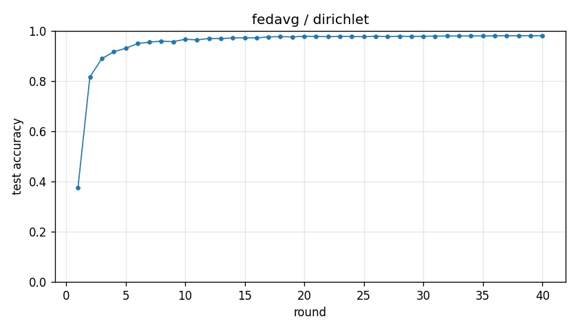

# Experiment report -- fedavg / dirichlet

## Configuration

| Key | Value |
|---|---|
| algorithm | fedavg |
| partition | dirichlet |
| num_clients | 10 |
| classes_per_client | 2 |
| alpha | 0.1 |
| rounds | 40 |
| local_epochs | 5 |
| local_lr | 0.01 |
| batch_size | 64 |
| participation_rate | 1.0 |
| mu | 0.01 |
| seed | 0 |
| device | cuda |
| output_dir | results/ablation_mu_fedavg |
| log_every | 1 |

## Partition

- Number of clients with data: **10**
- Samples per client: min=1973, median=5237, max=16224, total=60000

## Results

- Final test accuracy (round 40): **0.9804**
- Best test accuracy: **0.9806** at round 38
- Final test loss: 0.0620
- Rounds to 0.90 acc: 4
- Rounds to 0.95 acc: 7
- Wall clock: 1007.5s

## Per-round history

| Round | Test acc | Test loss | Clients |
|---|---|---|---|
| 1 | 0.3751 | 1.6384 | 10 |
| 2 | 0.8159 | 0.5873 | 10 |
| 3 | 0.8888 | 0.3441 | 10 |
| 4 | 0.9165 | 0.2577 | 10 |
| 5 | 0.9302 | 0.2100 | 10 |
| 6 | 0.9489 | 0.1624 | 10 |
| 7 | 0.9550 | 0.1366 | 10 |
| 8 | 0.9588 | 0.1247 | 10 |
| 9 | 0.9567 | 0.1272 | 10 |
| 10 | 0.9664 | 0.1033 | 10 |
| 11 | 0.9640 | 0.1046 | 10 |
| 12 | 0.9695 | 0.0933 | 10 |
| 13 | 0.9693 | 0.0921 | 10 |
| 14 | 0.9714 | 0.0882 | 10 |
| 15 | 0.9722 | 0.0864 | 10 |
| 16 | 0.9720 | 0.0860 | 10 |
| 17 | 0.9757 | 0.0804 | 10 |
| 18 | 0.9768 | 0.0753 | 10 |
| 19 | 0.9758 | 0.0770 | 10 |
| 20 | 0.9781 | 0.0711 | 10 |
| 21 | 0.9778 | 0.0730 | 10 |
| 22 | 0.9763 | 0.0734 | 10 |
| 23 | 0.9781 | 0.0691 | 10 |
| 24 | 0.9774 | 0.0704 | 10 |
| 25 | 0.9764 | 0.0706 | 10 |
| 26 | 0.9783 | 0.0655 | 10 |
| 27 | 0.9766 | 0.0697 | 10 |
| 28 | 0.9786 | 0.0650 | 10 |
| 29 | 0.9776 | 0.0673 | 10 |
| 30 | 0.9782 | 0.0667 | 10 |
| 31 | 0.9789 | 0.0631 | 10 |
| 32 | 0.9794 | 0.0622 | 10 |
| 33 | 0.9793 | 0.0623 | 10 |
| 34 | 0.9798 | 0.0608 | 10 |
| 35 | 0.9794 | 0.0633 | 10 |
| 36 | 0.9802 | 0.0614 | 10 |
| 37 | 0.9805 | 0.0607 | 10 |
| 38 | 0.9806 | 0.0597 | 10 |
| 39 | 0.9805 | 0.0607 | 10 |
| 40 | 0.9804 | 0.0620 | 10 |

