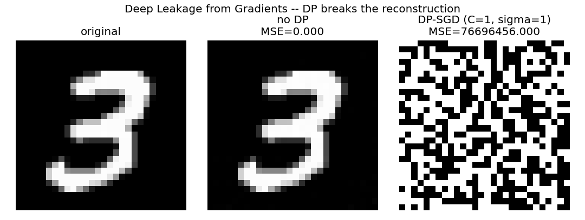

# Deep Leakage from Gradients -- with and without DP (Phase 8.3)

Single MNIST image reconstructed from its gradient by LBFGS
gradient-matching (Zhu et al. 2019), on a smooth-activation CNN.

| Setting | Reconstruction MSE vs original | Gradient-match loss |
|---|---|---|
| No DP | 0.0000 | 3.454e-07 |
| DP-SGD (C=1, sigma=1) | 76696456.0000 | 9.820e+03 |

**Leak demonstrated (no-DP MSE << DP MSE): PASS**

## Interpretation

Without privacy, the gradient of a single example carries enough
information to reconstruct that example -- so 'we only share
gradients, not data' is NOT a privacy guarantee. Clipping + Gaussian
noise (the same DP-SGD primitives in `privacy/dp.py`) destroy the
fine structure the attack relies on, and the reconstruction fails.
This is the empirical case for pairing FL with DP and/or SecAgg.

Activation note: DLG needs smooth activations (sigmoid) for the
LBFGS gradient-matching to converge; ReLU+MaxPool have ill-defined
second derivatives. The lesson is activation-independent.
