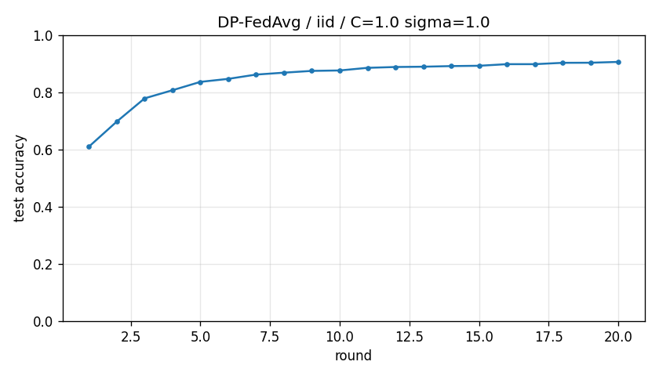

# DP-FedAvg report -- iid

## Configuration

| Key | Value |
|---|---|
| partition | iid |
| alpha | 0.1 |
| num_clients | 10 |
| rounds | 20 |
| local_epochs | 1 |
| local_lr | 0.05 |
| batch_size | 32 |
| clip_C | 1.0 |
| noise_sigma | 1.0 |
| seed | 0 |
| output_dir | results/dp_fedavg_iid_C1_s1 |

## Privacy (naive, not RDP)

- Noise sigma: 1.0
- Clip C: 1.0
- Total local SGD steps: 3760
- Approx sample rate: 0.0053
- Naive epsilon estimate (delta=1e-5): **1425.54**
  - Note: Abadi's RDP accountant gives much tighter bounds.

## Results

- Final accuracy (round 20): **0.9063**
- Best accuracy: 0.9063
- Rounds to 0.90: 18
- Wall clock: 208.4s

## History

| Round | Acc | Loss |
|---|---|---|
| 1 | 0.6100 | 1.6943 |
| 2 | 0.6976 | 0.9510 |
| 3 | 0.7789 | 0.6791 |
| 4 | 0.8073 | 0.6107 |
| 5 | 0.8365 | 0.5506 |
| 6 | 0.8470 | 0.5441 |
| 7 | 0.8620 | 0.5267 |
| 8 | 0.8687 | 0.5307 |
| 9 | 0.8749 | 0.5241 |
| 10 | 0.8764 | 0.5380 |
| 11 | 0.8856 | 0.5216 |
| 12 | 0.8885 | 0.5113 |
| 13 | 0.8895 | 0.5181 |
| 14 | 0.8917 | 0.5182 |
| 15 | 0.8928 | 0.5246 |
| 16 | 0.8984 | 0.4993 |
| 17 | 0.8984 | 0.5038 |
| 18 | 0.9031 | 0.4973 |
| 19 | 0.9034 | 0.5069 |
| 20 | 0.9063 | 0.5123 |

