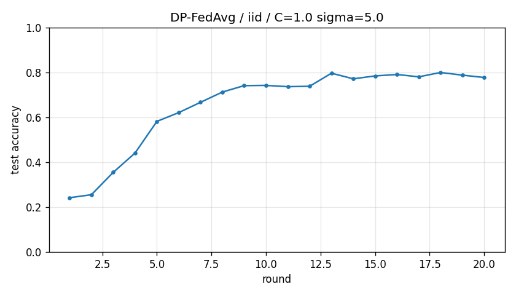

# DP-FedAvg report -- iid

## Configuration

| Key | Value |
|---|---|
| partition | iid |
| alpha | 0.1 |
| num_clients | 10 |
| rounds | 20 |
| local_epochs | 1 |
| local_lr | 0.05 |
| batch_size | 32 |
| clip_C | 1.0 |
| noise_sigma | 5.0 |
| seed | 0 |
| output_dir | results/dp_fedavg_iid_C1_s5 |

## Privacy (naive, not RDP)

- Noise sigma: 5.0
- Clip C: 1.0
- Total local SGD steps: 3760
- Approx sample rate: 0.0053
- Naive epsilon estimate (delta=1e-5): **285.11**
  - Note: Abadi's RDP accountant gives much tighter bounds.

## Results

- Final accuracy (round 20): **0.7774**
- Best accuracy: 0.7998
- Rounds to 0.90: not reached
- Wall clock: 206.3s

## History

| Round | Acc | Loss |
|---|---|---|
| 1 | 0.2419 | 2.2166 |
| 2 | 0.2553 | 2.1572 |
| 3 | 0.3549 | 1.8679 |
| 4 | 0.4410 | 1.6158 |
| 5 | 0.5819 | 1.3509 |
| 6 | 0.6210 | 1.2555 |
| 7 | 0.6669 | 1.0841 |
| 8 | 0.7126 | 0.9894 |
| 9 | 0.7412 | 0.9603 |
| 10 | 0.7423 | 1.0770 |
| 11 | 0.7366 | 1.2945 |
| 12 | 0.7383 | 1.2146 |
| 13 | 0.7966 | 1.0116 |
| 14 | 0.7716 | 1.1987 |
| 15 | 0.7844 | 1.2742 |
| 16 | 0.7908 | 1.3160 |
| 17 | 0.7804 | 1.3640 |
| 18 | 0.7998 | 1.3630 |
| 19 | 0.7879 | 1.5109 |
| 20 | 0.7774 | 1.6541 |

