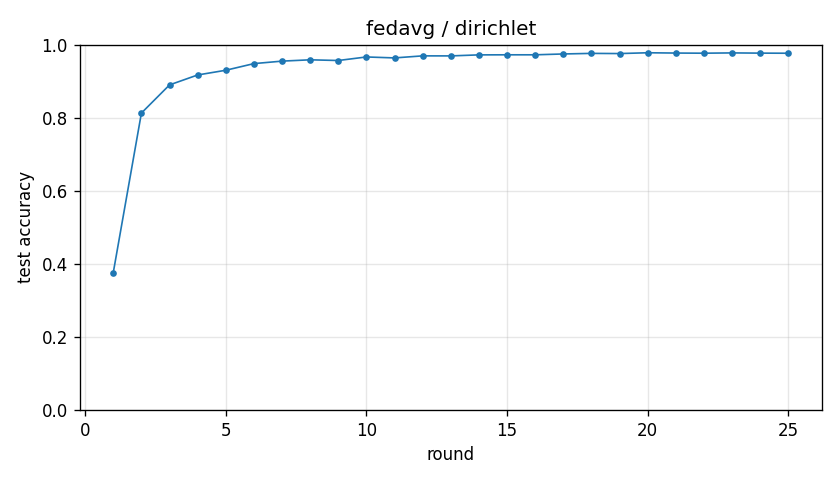

# Experiment report -- fedavg / dirichlet

## Configuration

| Key | Value |
|---|---|
| algorithm | fedavg |
| partition | dirichlet |
| num_clients | 10 |
| classes_per_client | 2 |
| alpha | 0.1 |
| rounds | 25 |
| local_epochs | 5 |
| local_lr | 0.01 |
| batch_size | 64 |
| participation_rate | 1.0 |
| mu | 0.01 |
| seed | 0 |
| device | cuda |
| output_dir | results/fedavg_dirichlet_a0.1 |
| log_every | 1 |

## Partition

- Number of clients with data: **10**
- Samples per client: min=1973, median=5237, max=16224, total=60000

## Results

- Final test accuracy (round 25): **0.9769**
- Best test accuracy: **0.9782** at round 20
- Final test loss: 0.0706
- Rounds to 0.90 acc: 4
- Rounds to 0.95 acc: 7
- Wall clock: 930.1s

## Per-round history

| Round | Test acc | Test loss | Clients |
|---|---|---|---|
| 1 | 0.3765 | 1.6373 | 10 |
| 2 | 0.8131 | 0.5890 | 10 |
| 3 | 0.8902 | 0.3406 | 10 |
| 4 | 0.9174 | 0.2560 | 10 |
| 5 | 0.9303 | 0.2111 | 10 |
| 6 | 0.9485 | 0.1630 | 10 |
| 7 | 0.9553 | 0.1367 | 10 |
| 8 | 0.9589 | 0.1245 | 10 |
| 9 | 0.9570 | 0.1266 | 10 |
| 10 | 0.9667 | 0.1034 | 10 |
| 11 | 0.9641 | 0.1049 | 10 |
| 12 | 0.9697 | 0.0932 | 10 |
| 13 | 0.9696 | 0.0919 | 10 |
| 14 | 0.9724 | 0.0875 | 10 |
| 15 | 0.9726 | 0.0865 | 10 |
| 16 | 0.9726 | 0.0851 | 10 |
| 17 | 0.9749 | 0.0806 | 10 |
| 18 | 0.9765 | 0.0757 | 10 |
| 19 | 0.9760 | 0.0772 | 10 |
| 20 | 0.9782 | 0.0713 | 10 |
| 21 | 0.9774 | 0.0734 | 10 |
| 22 | 0.9770 | 0.0735 | 10 |
| 23 | 0.9778 | 0.0694 | 10 |
| 24 | 0.9772 | 0.0704 | 10 |
| 25 | 0.9769 | 0.0706 | 10 |

