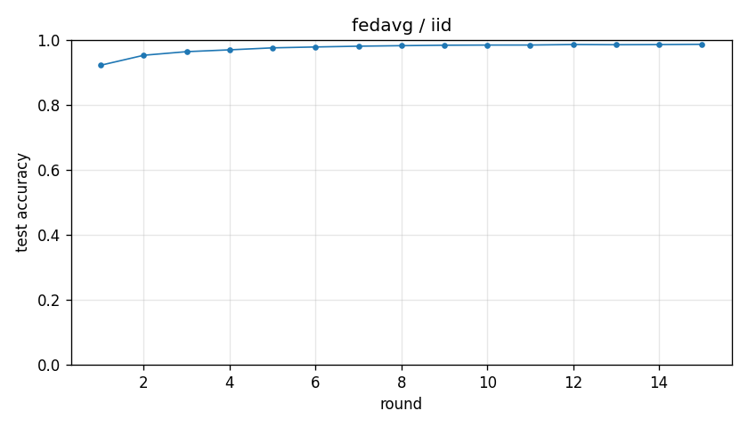

# Experiment report -- fedavg / iid

## Configuration

| Key | Value |
|---|---|
| algorithm | fedavg |
| partition | iid |
| num_clients | 10 |
| classes_per_client | 2 |
| alpha | 0.1 |
| rounds | 15 |
| local_epochs | 5 |
| local_lr | 0.01 |
| batch_size | 64 |
| participation_rate | 1.0 |
| mu | 0.01 |
| seed | 0 |
| device | cuda |
| output_dir | results/fedavg_iid |
| log_every | 1 |

## Partition

- Number of clients with data: **10**
- Samples per client: min=6000, median=6000, max=6000, total=60000

## Results

- Final test accuracy (round 15): **0.9863**
- Best test accuracy: **0.9863** at round 15
- Final test loss: 0.0438
- Rounds to 0.90 acc: 1
- Rounds to 0.95 acc: 2
- Wall clock: 467.0s

## Per-round history

| Round | Test acc | Test loss | Clients |
|---|---|---|---|
| 1 | 0.9220 | 0.2780 | 10 |
| 2 | 0.9526 | 0.1658 | 10 |
| 3 | 0.9637 | 0.1217 | 10 |
| 4 | 0.9693 | 0.0967 | 10 |
| 5 | 0.9754 | 0.0822 | 10 |
| 6 | 0.9781 | 0.0721 | 10 |
| 7 | 0.9805 | 0.0643 | 10 |
| 8 | 0.9821 | 0.0599 | 10 |
| 9 | 0.9835 | 0.0562 | 10 |
| 10 | 0.9840 | 0.0532 | 10 |
| 11 | 0.9841 | 0.0503 | 10 |
| 12 | 0.9856 | 0.0475 | 10 |
| 13 | 0.9850 | 0.0478 | 10 |
| 14 | 0.9854 | 0.0454 | 10 |
| 15 | 0.9863 | 0.0438 | 10 |

