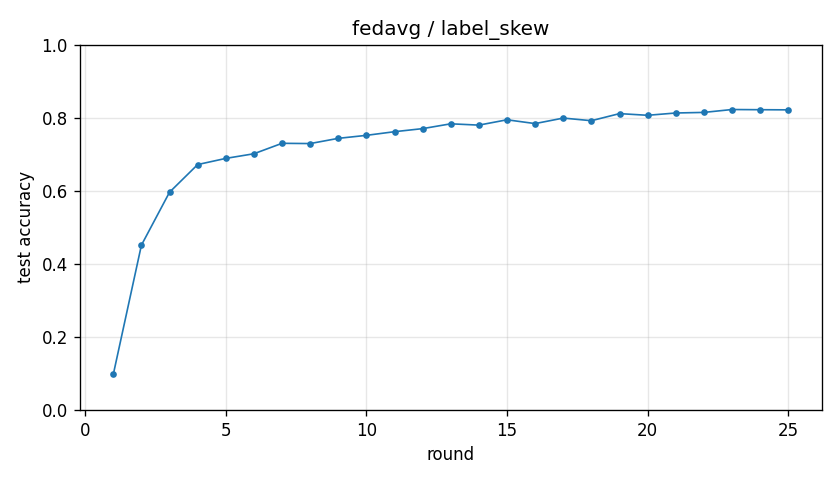

# Experiment report -- fedavg / label_skew

## Configuration

| Key | Value |
|---|---|
| algorithm | fedavg |
| partition | label_skew |
| num_clients | 10 |
| classes_per_client | 2 |
| alpha | 0.1 |
| rounds | 25 |
| local_epochs | 5 |
| local_lr | 0.01 |
| batch_size | 64 |
| participation_rate | 1.0 |
| mu | 0.01 |
| seed | 0 |
| device | cuda |
| output_dir | results/fedavg_labelskew_2 |
| log_every | 1 |

## Partition

- Number of clients with data: **10**
- Samples per client: min=3019, median=4354, max=12593, total=54077

## Results

- Final test accuracy (round 25): **0.8219**
- Best test accuracy: **0.8228** at round 23
- Final test loss: 1.2048
- Rounds to 0.90 acc: not reached
- Rounds to 0.95 acc: not reached
- Wall clock: 886.6s

## Per-round history

| Round | Test acc | Test loss | Clients |
|---|---|---|---|
| 1 | 0.0974 | 2.5268 | 10 |
| 2 | 0.4514 | 1.8800 | 10 |
| 3 | 0.5964 | 1.6033 | 10 |
| 4 | 0.6721 | 1.4312 | 10 |
| 5 | 0.6890 | 1.3698 | 10 |
| 6 | 0.7017 | 1.3487 | 10 |
| 7 | 0.7303 | 1.3273 | 10 |
| 8 | 0.7296 | 1.3122 | 10 |
| 9 | 0.7439 | 1.2992 | 10 |
| 10 | 0.7521 | 1.2714 | 10 |
| 11 | 0.7621 | 1.2823 | 10 |
| 12 | 0.7705 | 1.2643 | 10 |
| 13 | 0.7837 | 1.2497 | 10 |
| 14 | 0.7801 | 1.2687 | 10 |
| 15 | 0.7947 | 1.2631 | 10 |
| 16 | 0.7843 | 1.2475 | 10 |
| 17 | 0.7994 | 1.2394 | 10 |
| 18 | 0.7922 | 1.2350 | 10 |
| 19 | 0.8116 | 1.2126 | 10 |
| 20 | 0.8070 | 1.2046 | 10 |
| 21 | 0.8133 | 1.2110 | 10 |
| 22 | 0.8149 | 1.1591 | 10 |
| 23 | 0.8228 | 1.1731 | 10 |
| 24 | 0.8223 | 1.1944 | 10 |
| 25 | 0.8219 | 1.2048 | 10 |

