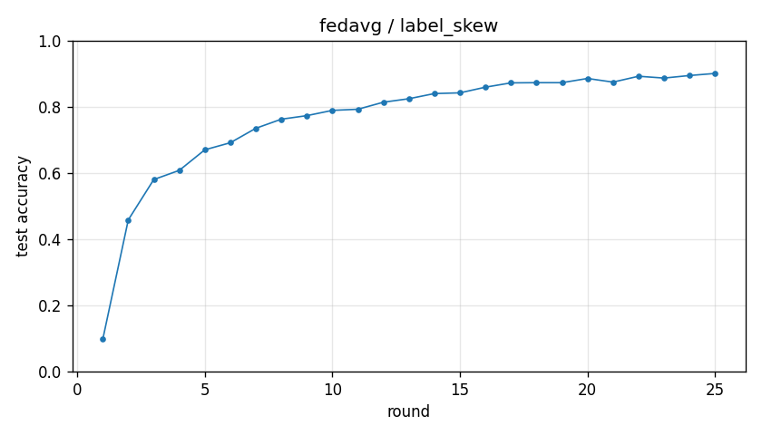

# Experiment report -- fedavg / label_skew

## Configuration

| Key | Value |
|---|---|
| algorithm | fedavg |
| partition | label_skew |
| num_clients | 10 |
| classes_per_client | 2 |
| alpha | 0.1 |
| rounds | 25 |
| local_epochs | 5 |
| local_lr | 0.01 |
| batch_size | 64 |
| participation_rate | 1.0 |
| mu | 0.01 |
| global_lr | 1.0 |
| seed | 0 |
| device | cuda |
| output_dir | results/fedavg_labelskew_2 |
| log_every | 1 |

## Partition

- Number of clients with data: **10**
- Samples per client: min=3019, median=4673, max=12593, total=60000

## Results

- Final test accuracy (round 25): **0.9008**
- Best test accuracy: **0.9008** at round 25
- Final test loss: 0.3078
- Rounds to 0.90 acc: 25
- Rounds to 0.95 acc: not reached
- Wall clock: 666.0s

## Per-round history

| Round | Test acc | Test loss | Clients |
|---|---|---|---|
| 1 | 0.0974 | 2.3353 | 10 |
| 2 | 0.4584 | 1.7187 | 10 |
| 3 | 0.5803 | 1.3547 | 10 |
| 4 | 0.6080 | 1.1886 | 10 |
| 5 | 0.6701 | 1.0247 | 10 |
| 6 | 0.6915 | 0.9050 | 10 |
| 7 | 0.7351 | 0.8155 | 10 |
| 8 | 0.7626 | 0.7113 | 10 |
| 9 | 0.7733 | 0.6721 | 10 |
| 10 | 0.7892 | 0.6068 | 10 |
| 11 | 0.7926 | 0.6112 | 10 |
| 12 | 0.8139 | 0.5470 | 10 |
| 13 | 0.8244 | 0.5096 | 10 |
| 14 | 0.8400 | 0.4749 | 10 |
| 15 | 0.8422 | 0.4601 | 10 |
| 16 | 0.8593 | 0.4223 | 10 |
| 17 | 0.8723 | 0.3960 | 10 |
| 18 | 0.8729 | 0.3865 | 10 |
| 19 | 0.8729 | 0.3773 | 10 |
| 20 | 0.8856 | 0.3586 | 10 |
| 21 | 0.8746 | 0.3658 | 10 |
| 22 | 0.8923 | 0.3393 | 10 |
| 23 | 0.8868 | 0.3391 | 10 |
| 24 | 0.8945 | 0.3236 | 10 |
| 25 | 0.9008 | 0.3078 | 10 |

