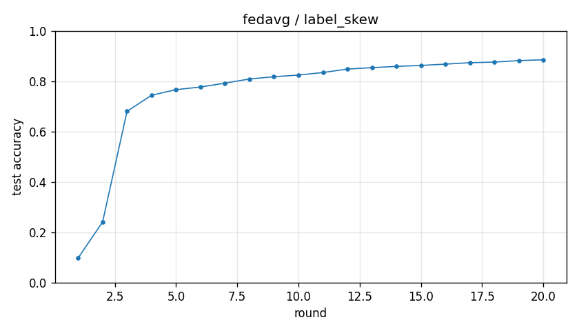

# Experiment report -- fedavg / label_skew

## Configuration

| Key | Value |
|---|---|
| algorithm | fedavg |
| partition | label_skew |
| num_clients | 100 |
| classes_per_client | 2 |
| alpha | 0.1 |
| rounds | 20 |
| local_epochs | 5 |
| local_lr | 0.01 |
| batch_size | 64 |
| participation_rate | 1.0 |
| mu | 0.01 |
| seed | 0 |
| device | cuda |
| output_dir | results/fedavg_labelskew_2_K100 |
| log_every | 1 |

## Partition

- Number of clients with data: **100**
- Samples per client: min=470, median=601, max=734, total=60000

## Results

- Final test accuracy (round 20): **0.8854**
- Best test accuracy: **0.8854** at round 20
- Final test loss: 0.4277
- Rounds to 0.90 acc: not reached
- Rounds to 0.95 acc: not reached
- Wall clock: 503.9s

## Per-round history

| Round | Test acc | Test loss | Clients |
|---|---|---|---|
| 1 | 0.0982 | 2.3061 | 100 |
| 2 | 0.2412 | 2.0077 | 100 |
| 3 | 0.6808 | 1.7174 | 100 |
| 4 | 0.7445 | 1.4765 | 100 |
| 5 | 0.7667 | 1.2750 | 100 |
| 6 | 0.7772 | 1.1123 | 100 |
| 7 | 0.7926 | 0.9807 | 100 |
| 8 | 0.8091 | 0.8757 | 100 |
| 9 | 0.8179 | 0.7941 | 100 |
| 10 | 0.8247 | 0.7302 | 100 |
| 11 | 0.8347 | 0.6764 | 100 |
| 12 | 0.8485 | 0.6297 | 100 |
| 13 | 0.8540 | 0.5927 | 100 |
| 14 | 0.8591 | 0.5592 | 100 |
| 15 | 0.8628 | 0.5308 | 100 |
| 16 | 0.8681 | 0.5040 | 100 |
| 17 | 0.8737 | 0.4800 | 100 |
| 18 | 0.8762 | 0.4622 | 100 |
| 19 | 0.8820 | 0.4437 | 100 |
| 20 | 0.8854 | 0.4277 | 100 |

