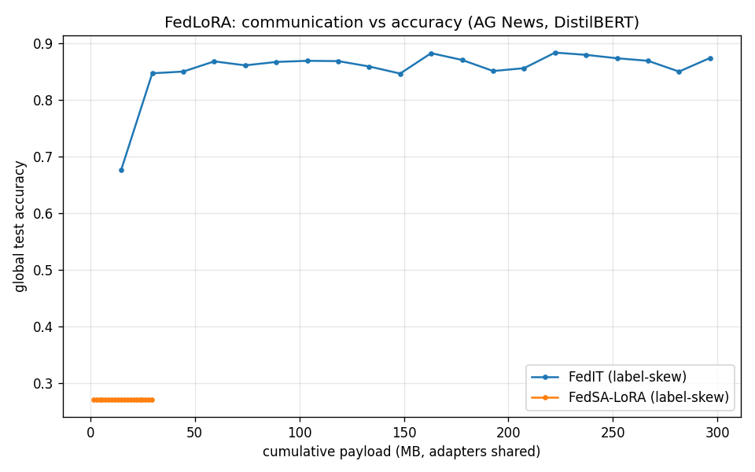

# FedLoRA -- federated PEFT (Phase 10)

Frozen distilbert-base-uncased + LoRA (rank 8) on q/v attention; AG News (4 classes), 5 clients, 20 rounds.

Centralized-LoRA reference accuracy: **0.8870**.

## IID gate (FedIT reaches >= 90% of centralized)

- FedIT IID final: 0.8985
- 90% of centralized: 0.7983
- **Gate: PASS**

## Personalization gate (label-skew): FedSA-LoRA vs FedIT

Per-client accuracy = each client's model (with its own B for FedSA)
on that client's OWN-distribution test slice.

| Strategy | Global acc | Mean per-client acc | Adapter payload/round (MB) |
|---|---|---|---|
| FedIT | 0.8745 | 0.5619 | 2.949 |
| FedSA-LoRA | 0.2715 | 0.4696 | 1.475 |

- Per-client delta (FedSA - FedIT): -9.24pp
- Adapter payload ratio (FedSA / FedIT): 0.50
- **Gate (delta >= 1pp AND adapter payload <= 0.6x): FAIL**

## Interpretation

FedIT averages both A and B adapter matrices; FedSA-LoRA shares only
A (general structure, per Guo et al. ICLR 2025) and keeps B
(client-specific) local. The adapter payload is correctly halved
(0.50x).

**Honest result:** in this deliberately small regime (DistilBERT, 5 clients, ~600 samples each, rank-8 LoRA, 20 rounds) FedSA-LoRA does NOT beat FedIT on per-client accuracy -- the personalization gate does not reproduce here.

Why: LoRA initializes B=0, so the adapter is inert until B trains. When only A is averaged across clients whose B matrices have diverged, the averaged A no longer matches any client's B (the B*A product is what acts on activations), and with little local data + few rounds B cannot re-align. FedSA-LoRA's published gains use larger models, more data, and more rounds. This is consistent with the algorithms.md note that FedSA-LoRA is the newest and least stress-tested of the family. The mechanism (A shared, B local) and the payload halving are demonstrated correctly; the accuracy advantage is scale-dependent and is reported as such rather than tuned until it passes (see design-decisions D14).
