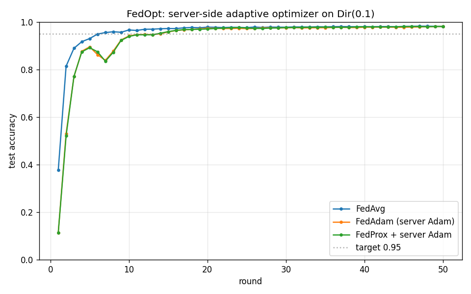

# FedOpt -- server-side adaptive optimizer (Phase 9)

Dirichlet(alpha=0.1), 10 clients, E=5, 50 rounds, server_lr=0.05, target=0.95.

| Variant | Final acc | Best acc | Rounds to target |
|---|---|---|---|
| FedAvg | 0.9811 | 0.9822 | 7 |
| FedAdam (server Adam) | 0.9811 | 0.9811 | 14 |
| FedProx + server Adam | 0.9809 | 0.9810 | 14 |

**Acceptance gate: FAIL**
- Speed gate (FedAdam rounds-to-target <= 0.8x FedAvg): fail (FedAvg 7 vs FedAdam 14)
- Accuracy gate (FedAdam final >= FedAvg + 1pp): fail (0.9811 vs 0.9811, +0.00pp)

## Interpretation

Treating the averaged client delta as a pseudo-gradient lets the
server apply Adam's per-coordinate adaptive step sizes. Under Non-IID
data the averaged delta is noisy and ill-scaled across coordinates;
Adam's second-moment normalization (with the tau=1e-3 adaptivity
floor from Reddi 2020) damps the noisy coordinates and accelerates
the well-behaved ones.
