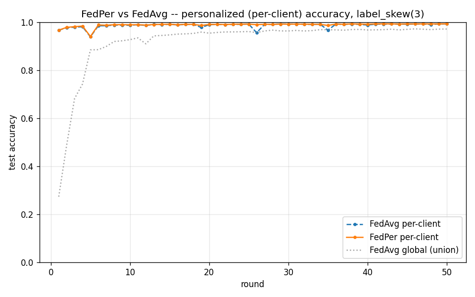

# FedPer vs FedAvg -- personalized FL (Phase 7)

Partition: label_skew(3), 10 clients, 50 rounds, seed 0.
Per-client metric: each client evaluated on a held-out 20% slice of
its own data, using the shared body + its own head (FedPer) or the
single global model (FedAvg).

| Metric | FedAvg | FedPer | Delta |
|---|---|---|---|
| Mean per-client acc (round 50) | 0.9929 | 0.9933 | +0.0004 |
| Global acc on union test | 0.9715 | 0.3460 | -0.6255 |

**Acceptance gate (FedPer per-client >= FedAvg + 3pp): FAIL** (delta = +0.04pp)

## Interpretation

Under sharp label skew each client's optimal classifier head differs.
FedPer lets the head specialize while still sharing the feature
extractor. The global (union) metric is expected to be LOWER for
FedPer (no single head serves all clients) -- that is the
personalization/generalization trade-off, not a regression.

**Honest note:** on this partition FedAvg's per-client accuracy is
already 0.993 -- the per-client metric is
saturated, leaving no 3pp of headroom for FedPer to capture. The
FedPer global-metric collapse confirms the head specialized (the
mechanism works); the gate simply needs a partition where the
shared global model is genuinely compromised. See the harder
label_skew variant and design-decisions D16.
