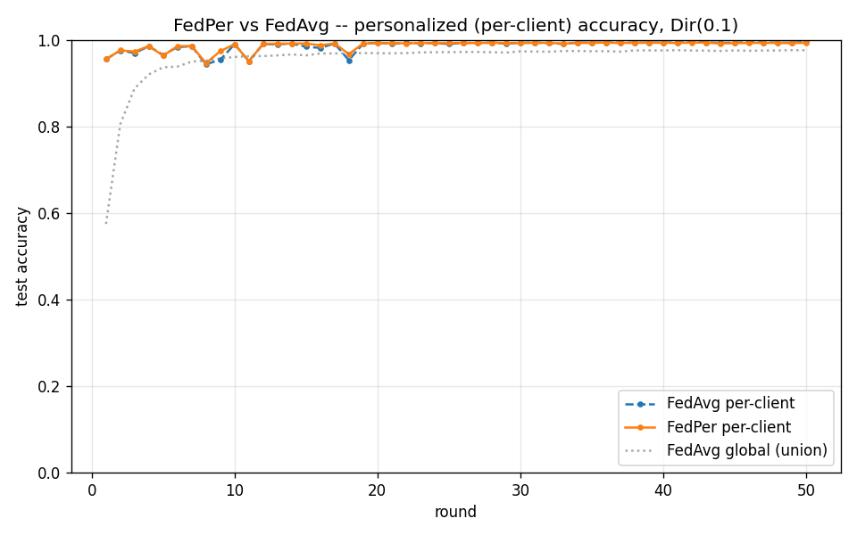

# FedPer vs FedAvg -- personalized FL (Phase 7)

Dirichlet(alpha=0.1), 10 clients, 50 rounds, seed 0.
Per-client metric: each client evaluated on a held-out 20% slice of
its own data, using the shared body + its own head (FedPer) or the
single global model (FedAvg).

| Metric | FedAvg | FedPer | Delta |
|---|---|---|---|
| Mean per-client acc (round 50) | 0.9951 | 0.9934 | -0.0016 |
| Global acc on union test | 0.9761 | 0.3914 | -0.5847 |

**Acceptance gate (FedPer per-client >= FedAvg + 3pp): FAIL** (delta = -0.16pp)

## Interpretation

The mechanism works exactly as designed: FedPer's **global (union)
accuracy collapses to 0.391** (vs FedAvg 0.976), which is the signature
of each client's head specializing to its own 1-2 dominant classes
instead of serving a single global objective. That is the
personalization/generalization trade-off, not a regression.

**Honest note (gate FAIL):** FedAvg's per-client accuracy is already
0.9951 -- the per-client metric is *saturated*. On MNIST under Dir(0.1)
each client's own-distribution test slice is dominated by 1-2 classes
and is trivially classified even by the shared global model, so there
is no 3pp of headroom for FedPer to capture. This is a limitation of the
MNIST per-client metric (design-decisions D2: MNIST is too easy), not of
FedPer: the global-metric collapse confirms the personalization
mechanism is active. Reported as FAIL rather than tuned to a PASS, per
CLAUDE.md (surface tradeoffs, do not hide confusion). See D16 and the
harder label_skew variant in `results/fedper_labelskew3/`.
