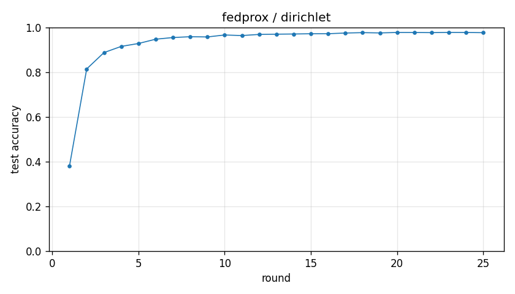

# Experiment report -- fedprox / dirichlet

## Configuration

| Key | Value |
|---|---|
| algorithm | fedprox |
| partition | dirichlet |
| num_clients | 10 |
| classes_per_client | 2 |
| alpha | 0.1 |
| rounds | 25 |
| local_epochs | 5 |
| local_lr | 0.01 |
| batch_size | 64 |
| participation_rate | 1.0 |
| mu | 0.01 |
| seed | 0 |
| device | cuda |
| output_dir | results/fedprox_dirichlet_a0.1_mu0.01 |
| log_every | 1 |

## Partition

- Number of clients with data: **10**
- Samples per client: min=1973, median=5237, max=16224, total=60000

## Results

- Final test accuracy (round 25): **0.9766**
- Best test accuracy: **0.9778** at round 23
- Final test loss: 0.0712
- Rounds to 0.90 acc: 4
- Rounds to 0.95 acc: 7
- Wall clock: 919.3s

## Per-round history

| Round | Test acc | Test loss | Clients |
|---|---|---|---|
| 1 | 0.3798 | 1.6489 | 10 |
| 2 | 0.8146 | 0.6025 | 10 |
| 3 | 0.8875 | 0.3504 | 10 |
| 4 | 0.9152 | 0.2632 | 10 |
| 5 | 0.9282 | 0.2161 | 10 |
| 6 | 0.9474 | 0.1669 | 10 |
| 7 | 0.9549 | 0.1397 | 10 |
| 8 | 0.9585 | 0.1277 | 10 |
| 9 | 0.9575 | 0.1281 | 10 |
| 10 | 0.9663 | 0.1049 | 10 |
| 11 | 0.9637 | 0.1055 | 10 |
| 12 | 0.9688 | 0.0944 | 10 |
| 13 | 0.9699 | 0.0929 | 10 |
| 14 | 0.9707 | 0.0896 | 10 |
| 15 | 0.9718 | 0.0870 | 10 |
| 16 | 0.9720 | 0.0860 | 10 |
| 17 | 0.9750 | 0.0810 | 10 |
| 18 | 0.9768 | 0.0761 | 10 |
| 19 | 0.9755 | 0.0779 | 10 |
| 20 | 0.9775 | 0.0724 | 10 |
| 21 | 0.9774 | 0.0736 | 10 |
| 22 | 0.9768 | 0.0737 | 10 |
| 23 | 0.9778 | 0.0694 | 10 |
| 24 | 0.9775 | 0.0709 | 10 |
| 25 | 0.9766 | 0.0712 | 10 |

