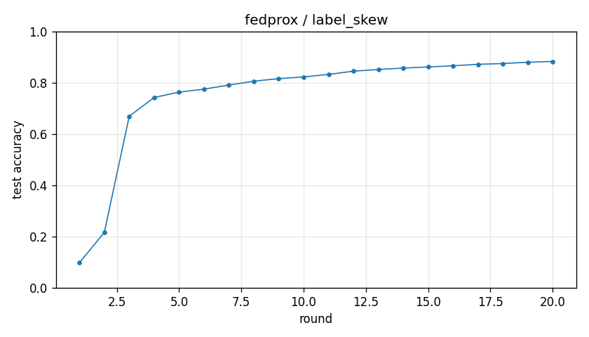

# Experiment report -- fedprox / label_skew

## Configuration

| Key | Value |
|---|---|
| algorithm | fedprox |
| partition | label_skew |
| num_clients | 100 |
| classes_per_client | 2 |
| alpha | 0.1 |
| rounds | 20 |
| local_epochs | 5 |
| local_lr | 0.01 |
| batch_size | 64 |
| participation_rate | 1.0 |
| mu | 0.1 |
| seed | 0 |
| device | cuda |
| output_dir | results/fedprox_labelskew_2_K100_mu0.1 |
| log_every | 1 |

## Partition

- Number of clients with data: **100**
- Samples per client: min=470, median=601, max=734, total=60000

## Results

- Final test accuracy (round 20): **0.8830**
- Best test accuracy: **0.8830** at round 20
- Final test loss: 0.4347
- Rounds to 0.90 acc: not reached
- Rounds to 0.95 acc: not reached
- Wall clock: 516.5s

## Per-round history

| Round | Test acc | Test loss | Clients |
|---|---|---|---|
| 1 | 0.0983 | 2.3046 | 100 |
| 2 | 0.2165 | 2.0195 | 100 |
| 3 | 0.6695 | 1.7323 | 100 |
| 4 | 0.7425 | 1.4924 | 100 |
| 5 | 0.7634 | 1.2915 | 100 |
| 6 | 0.7751 | 1.1285 | 100 |
| 7 | 0.7909 | 0.9963 | 100 |
| 8 | 0.8061 | 0.8903 | 100 |
| 9 | 0.8161 | 0.8074 | 100 |
| 10 | 0.8226 | 0.7426 | 100 |
| 11 | 0.8326 | 0.6878 | 100 |
| 12 | 0.8451 | 0.6400 | 100 |
| 13 | 0.8516 | 0.6025 | 100 |
| 14 | 0.8573 | 0.5686 | 100 |
| 15 | 0.8615 | 0.5399 | 100 |
| 16 | 0.8662 | 0.5132 | 100 |
| 17 | 0.8719 | 0.4882 | 100 |
| 18 | 0.8748 | 0.4699 | 100 |
| 19 | 0.8799 | 0.4512 | 100 |
| 20 | 0.8830 | 0.4347 | 100 |

