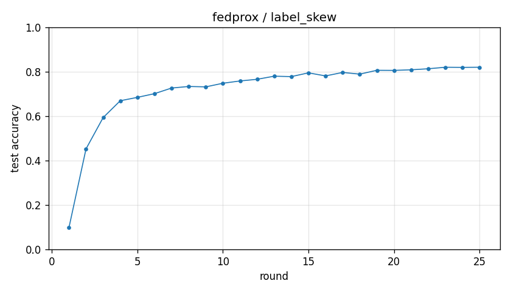

# Experiment report -- fedprox / label_skew

## Configuration

| Key | Value |
|---|---|
| algorithm | fedprox |
| partition | label_skew |
| num_clients | 10 |
| classes_per_client | 2 |
| alpha | 0.1 |
| rounds | 25 |
| local_epochs | 5 |
| local_lr | 0.01 |
| batch_size | 64 |
| participation_rate | 1.0 |
| mu | 0.01 |
| seed | 0 |
| device | cuda |
| output_dir | results/fedprox_labelskew_2_mu0.01 |
| log_every | 1 |

## Partition

- Number of clients with data: **10**
- Samples per client: min=3019, median=4354, max=12593, total=54077

## Results

- Final test accuracy (round 25): **0.8201**
- Best test accuracy: **0.8201** at round 25
- Final test loss: 1.2250
- Rounds to 0.90 acc: not reached
- Rounds to 0.95 acc: not reached
- Wall clock: 964.6s

## Per-round history

| Round | Test acc | Test loss | Clients |
|---|---|---|---|
| 1 | 0.0974 | 2.4794 | 10 |
| 2 | 0.4526 | 1.8996 | 10 |
| 3 | 0.5934 | 1.6205 | 10 |
| 4 | 0.6692 | 1.4489 | 10 |
| 5 | 0.6844 | 1.3830 | 10 |
| 6 | 0.7011 | 1.3550 | 10 |
| 7 | 0.7264 | 1.3317 | 10 |
| 8 | 0.7335 | 1.3163 | 10 |
| 9 | 0.7317 | 1.2930 | 10 |
| 10 | 0.7480 | 1.2708 | 10 |
| 11 | 0.7583 | 1.2869 | 10 |
| 12 | 0.7658 | 1.2713 | 10 |
| 13 | 0.7798 | 1.2631 | 10 |
| 14 | 0.7779 | 1.2832 | 10 |
| 15 | 0.7948 | 1.2769 | 10 |
| 16 | 0.7810 | 1.2662 | 10 |
| 17 | 0.7966 | 1.2614 | 10 |
| 18 | 0.7890 | 1.2540 | 10 |
| 19 | 0.8063 | 1.2356 | 10 |
| 20 | 0.8059 | 1.2259 | 10 |
| 21 | 0.8085 | 1.2374 | 10 |
| 22 | 0.8132 | 1.1751 | 10 |
| 23 | 0.8200 | 1.1933 | 10 |
| 24 | 0.8194 | 1.2135 | 10 |
| 25 | 0.8201 | 1.2250 | 10 |

