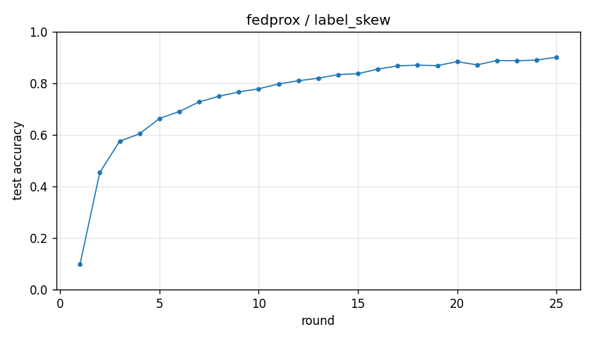

# Experiment report -- fedprox / label_skew

## Configuration

| Key | Value |
|---|---|
| algorithm | fedprox |
| partition | label_skew |
| num_clients | 10 |
| classes_per_client | 2 |
| alpha | 0.1 |
| rounds | 25 |
| local_epochs | 5 |
| local_lr | 0.01 |
| batch_size | 64 |
| participation_rate | 1.0 |
| mu | 0.01 |
| global_lr | 1.0 |
| seed | 0 |
| device | cuda |
| output_dir | results/fedprox_labelskew_2_mu0.01 |
| log_every | 1 |

## Partition

- Number of clients with data: **10**
- Samples per client: min=3019, median=4673, max=12593, total=60000

## Results

- Final test accuracy (round 25): **0.9010**
- Best test accuracy: **0.9010** at round 25
- Final test loss: 0.3125
- Rounds to 0.90 acc: 25
- Rounds to 0.95 acc: not reached
- Wall clock: 669.7s

## Per-round history

| Round | Test acc | Test loss | Clients |
|---|---|---|---|
| 1 | 0.0974 | 2.3143 | 10 |
| 2 | 0.4547 | 1.7413 | 10 |
| 3 | 0.5753 | 1.3744 | 10 |
| 4 | 0.6039 | 1.2040 | 10 |
| 5 | 0.6632 | 1.0432 | 10 |
| 6 | 0.6903 | 0.9214 | 10 |
| 7 | 0.7274 | 0.8394 | 10 |
| 8 | 0.7496 | 0.7418 | 10 |
| 9 | 0.7661 | 0.6983 | 10 |
| 10 | 0.7784 | 0.6299 | 10 |
| 11 | 0.7973 | 0.6044 | 10 |
| 12 | 0.8095 | 0.5603 | 10 |
| 13 | 0.8196 | 0.5225 | 10 |
| 14 | 0.8334 | 0.4891 | 10 |
| 15 | 0.8372 | 0.4714 | 10 |
| 16 | 0.8545 | 0.4322 | 10 |
| 17 | 0.8674 | 0.4044 | 10 |
| 18 | 0.8702 | 0.3934 | 10 |
| 19 | 0.8682 | 0.3857 | 10 |
| 20 | 0.8839 | 0.3624 | 10 |
| 21 | 0.8711 | 0.3714 | 10 |
| 22 | 0.8882 | 0.3439 | 10 |
| 23 | 0.8872 | 0.3387 | 10 |
| 24 | 0.8896 | 0.3315 | 10 |
| 25 | 0.9010 | 0.3125 | 10 |

