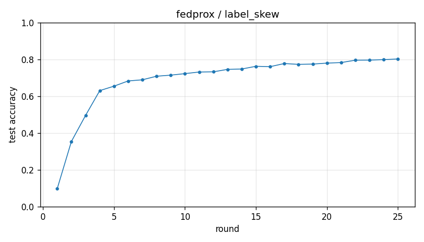

# Experiment report -- fedprox / label_skew

## Configuration

| Key | Value |
|---|---|
| algorithm | fedprox |
| partition | label_skew |
| num_clients | 10 |
| classes_per_client | 2 |
| alpha | 0.1 |
| rounds | 25 |
| local_epochs | 5 |
| local_lr | 0.01 |
| batch_size | 64 |
| participation_rate | 1.0 |
| mu | 0.1 |
| seed | 0 |
| device | cuda |
| output_dir | results/fedprox_labelskew_2_mu0.1 |
| log_every | 1 |

## Partition

- Number of clients with data: **10**
- Samples per client: min=3019, median=4354, max=12593, total=54077

## Results

- Final test accuracy (round 25): **0.8024**
- Best test accuracy: **0.8024** at round 25
- Final test loss: 1.2618
- Rounds to 0.90 acc: not reached
- Rounds to 0.95 acc: not reached
- Wall clock: 1023.0s

## Per-round history

| Round | Test acc | Test loss | Clients |
|---|---|---|---|
| 1 | 0.0974 | 2.3499 | 10 |
| 2 | 0.3542 | 2.0240 | 10 |
| 3 | 0.4960 | 1.7542 | 10 |
| 4 | 0.6306 | 1.5563 | 10 |
| 5 | 0.6547 | 1.4702 | 10 |
| 6 | 0.6831 | 1.4236 | 10 |
| 7 | 0.6893 | 1.3960 | 10 |
| 8 | 0.7088 | 1.3664 | 10 |
| 9 | 0.7146 | 1.3663 | 10 |
| 10 | 0.7229 | 1.3364 | 10 |
| 11 | 0.7316 | 1.3423 | 10 |
| 12 | 0.7327 | 1.3349 | 10 |
| 13 | 0.7459 | 1.3107 | 10 |
| 14 | 0.7479 | 1.3138 | 10 |
| 15 | 0.7626 | 1.3012 | 10 |
| 16 | 0.7606 | 1.3019 | 10 |
| 17 | 0.7777 | 1.2873 | 10 |
| 18 | 0.7731 | 1.2832 | 10 |
| 19 | 0.7747 | 1.2886 | 10 |
| 20 | 0.7800 | 1.2744 | 10 |
| 21 | 0.7829 | 1.2876 | 10 |
| 22 | 0.7957 | 1.2390 | 10 |
| 23 | 0.7963 | 1.2393 | 10 |
| 24 | 0.7990 | 1.2537 | 10 |
| 25 | 0.8024 | 1.2618 | 10 |

