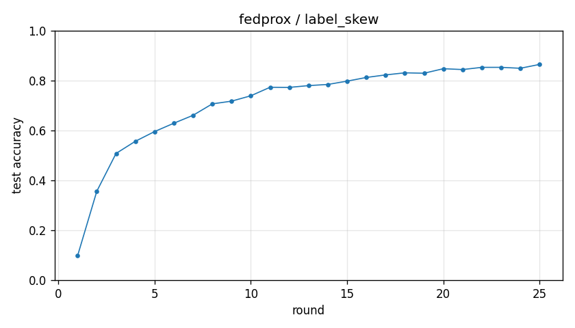

# Experiment report -- fedprox / label_skew

## Configuration

| Key | Value |
|---|---|
| algorithm | fedprox |
| partition | label_skew |
| num_clients | 10 |
| classes_per_client | 2 |
| alpha | 0.1 |
| rounds | 25 |
| local_epochs | 5 |
| local_lr | 0.01 |
| batch_size | 64 |
| participation_rate | 1.0 |
| mu | 0.1 |
| global_lr | 1.0 |
| seed | 0 |
| device | cuda |
| output_dir | results/fedprox_labelskew_2_mu0.1 |
| log_every | 1 |

## Partition

- Number of clients with data: **10**
- Samples per client: min=3019, median=4673, max=12593, total=60000

## Results

- Final test accuracy (round 25): **0.8646**
- Best test accuracy: **0.8646** at round 25
- Final test loss: 0.3852
- Rounds to 0.90 acc: not reached
- Rounds to 0.95 acc: not reached
- Wall clock: 678.5s

## Per-round history

| Round | Test acc | Test loss | Clients |
|---|---|---|---|
| 1 | 0.0974 | 2.2710 | 10 |
| 2 | 0.3564 | 1.8851 | 10 |
| 3 | 0.5078 | 1.5324 | 10 |
| 4 | 0.5565 | 1.3470 | 10 |
| 5 | 0.5955 | 1.1930 | 10 |
| 6 | 0.6289 | 1.0643 | 10 |
| 7 | 0.6607 | 0.9847 | 10 |
| 8 | 0.7065 | 0.8606 | 10 |
| 9 | 0.7174 | 0.8243 | 10 |
| 10 | 0.7389 | 0.7626 | 10 |
| 11 | 0.7730 | 0.7067 | 10 |
| 12 | 0.7725 | 0.6801 | 10 |
| 13 | 0.7797 | 0.6501 | 10 |
| 14 | 0.7843 | 0.6167 | 10 |
| 15 | 0.7975 | 0.5828 | 10 |
| 16 | 0.8123 | 0.5427 | 10 |
| 17 | 0.8225 | 0.5111 | 10 |
| 18 | 0.8309 | 0.4849 | 10 |
| 19 | 0.8293 | 0.4777 | 10 |
| 20 | 0.8474 | 0.4392 | 10 |
| 21 | 0.8440 | 0.4414 | 10 |
| 22 | 0.8528 | 0.4193 | 10 |
| 23 | 0.8529 | 0.4132 | 10 |
| 24 | 0.8491 | 0.4141 | 10 |
| 25 | 0.8646 | 0.3852 | 10 |

