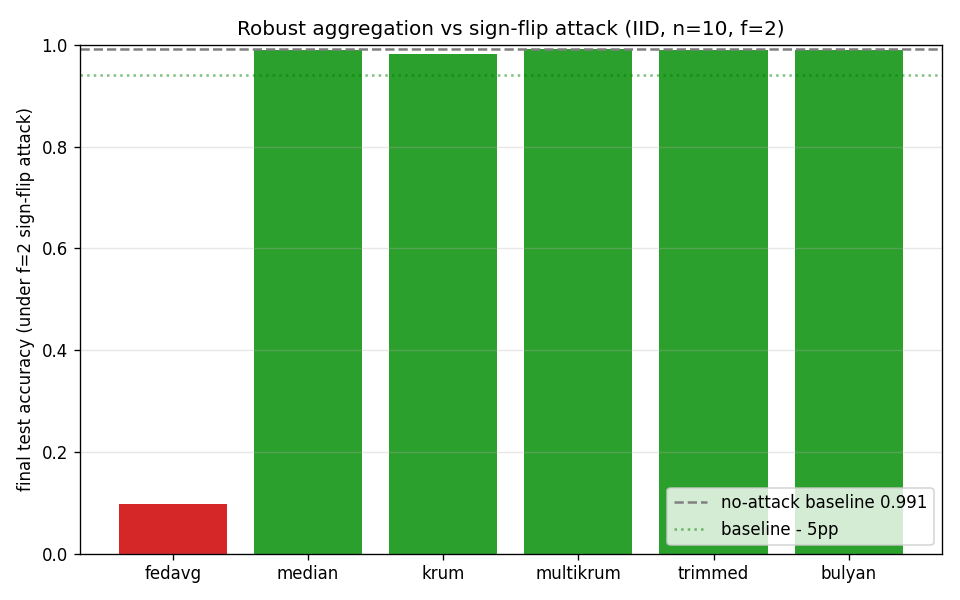

# Byzantine-robust aggregation (Phase 8.1/8.2)

IID MNIST, n=10 clients, f=2 Byzantine (sign-flip),
30 rounds, seed 0.

No-attack FedAvg baseline: **0.9914**.

| Aggregator | Final acc (under attack) | Drop vs baseline |
|---|---|---|
| fedavg | 0.0980 | +0.8934 |
| median | 0.9890 | +0.0024 |
| krum | 0.9827 | +0.0087 |
| multikrum | 0.9911 | +0.0003 |
| trimmed | 0.9888 | +0.0026 |
| bulyan | 0.9890 | +0.0024 |

**Acceptance gate: PASS**
- Median within 5pp of baseline: PASS (+0.0024)
- Krum within 5pp of baseline: PASS (+0.0087)
- FedAvg degrades >= 20pp: PASS (+0.8934)

## Liu et al. (ICML 2023) caveat

These results are on IID data, where the distance-based guarantee of
Krum/Bulyan holds: honest updates cluster, the attacker is an outlier.
Under strong Non-IID data (e.g. Dir(0.1)), honest-client divergence
becomes comparable to attacker divergence, so distance-based
aggregators silently lose their guarantee and can discard honest
minorities. Robust aggregation and heterogeneity-robustness are
distinct problems; classical aggregators solve only the former.
