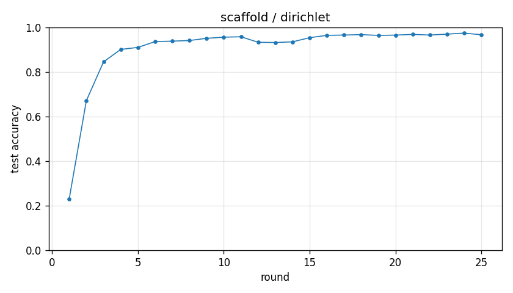

# Experiment report -- scaffold / dirichlet

## Configuration

| Key | Value |
|---|---|
| algorithm | scaffold |
| partition | dirichlet |
| num_clients | 10 |
| classes_per_client | 2 |
| alpha | 0.1 |
| rounds | 25 |
| local_epochs | 5 |
| local_lr | 0.01 |
| batch_size | 64 |
| participation_rate | 1.0 |
| mu | 0.01 |
| seed | 0 |
| device | cuda |
| output_dir | results/scaffold_dirichlet_a0.1 |
| log_every | 1 |

## Partition

- Number of clients with data: **10**
- Samples per client: min=1973, median=5237, max=16224, total=60000

## Results

- Final test accuracy (round 25): **0.9669**
- Best test accuracy: **0.9741** at round 24
- Final test loss: 0.1038
- Rounds to 0.90 acc: 4
- Rounds to 0.95 acc: 9
- Wall clock: 916.3s

## Per-round history

| Round | Test acc | Test loss | Clients |
|---|---|---|---|
| 1 | 0.2303 | 2.3902 | 10 |
| 2 | 0.6710 | 1.0267 | 10 |
| 3 | 0.8452 | 0.4896 | 10 |
| 4 | 0.9010 | 0.3019 | 10 |
| 5 | 0.9100 | 0.2674 | 10 |
| 6 | 0.9360 | 0.2040 | 10 |
| 7 | 0.9381 | 0.1933 | 10 |
| 8 | 0.9409 | 0.1860 | 10 |
| 9 | 0.9508 | 0.1564 | 10 |
| 10 | 0.9559 | 0.1423 | 10 |
| 11 | 0.9578 | 0.1371 | 10 |
| 12 | 0.9331 | 0.2007 | 10 |
| 13 | 0.9319 | 0.2071 | 10 |
| 14 | 0.9350 | 0.1907 | 10 |
| 15 | 0.9536 | 0.1448 | 10 |
| 16 | 0.9641 | 0.1142 | 10 |
| 17 | 0.9655 | 0.1096 | 10 |
| 18 | 0.9674 | 0.1030 | 10 |
| 19 | 0.9638 | 0.1156 | 10 |
| 20 | 0.9652 | 0.1114 | 10 |
| 21 | 0.9684 | 0.1021 | 10 |
| 22 | 0.9655 | 0.1059 | 10 |
| 23 | 0.9696 | 0.0893 | 10 |
| 24 | 0.9741 | 0.0787 | 10 |
| 25 | 0.9669 | 0.1038 | 10 |

