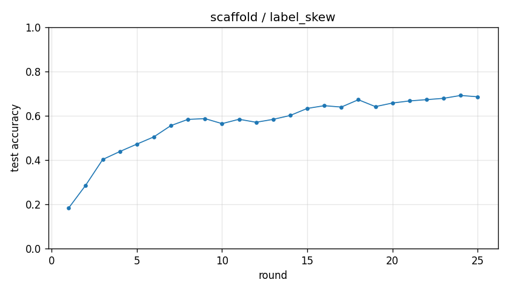

# Experiment report -- scaffold / label_skew

## Configuration

| Key | Value |
|---|---|
| algorithm | scaffold |
| partition | label_skew |
| num_clients | 10 |
| classes_per_client | 2 |
| alpha | 0.1 |
| rounds | 25 |
| local_epochs | 5 |
| local_lr | 0.01 |
| batch_size | 64 |
| participation_rate | 1.0 |
| mu | 0.01 |
| seed | 0 |
| device | cuda |
| output_dir | results/scaffold_labelskew_2 |
| log_every | 1 |

## Partition

- Number of clients with data: **10**
- Samples per client: min=3019, median=4354, max=12593, total=54077

## Results

- Final test accuracy (round 25): **0.6856**
- Best test accuracy: **0.6916** at round 24
- Final test loss: 1.4088
- Rounds to 0.90 acc: not reached
- Rounds to 0.95 acc: not reached
- Wall clock: 590.1s

## Per-round history

| Round | Test acc | Test loss | Clients |
|---|---|---|---|
| 1 | 0.1831 | 2.5586 | 10 |
| 2 | 0.2862 | 3.5111 | 10 |
| 3 | 0.4025 | 2.7105 | 10 |
| 4 | 0.4383 | 2.3954 | 10 |
| 5 | 0.4717 | 2.0298 | 10 |
| 6 | 0.5046 | 1.8970 | 10 |
| 7 | 0.5555 | 1.7494 | 10 |
| 8 | 0.5835 | 1.8113 | 10 |
| 9 | 0.5870 | 1.8006 | 10 |
| 10 | 0.5644 | 1.9366 | 10 |
| 11 | 0.5840 | 1.8049 | 10 |
| 12 | 0.5705 | 1.8053 | 10 |
| 13 | 0.5836 | 1.8268 | 10 |
| 14 | 0.6012 | 1.8258 | 10 |
| 15 | 0.6330 | 1.5151 | 10 |
| 16 | 0.6454 | 1.3339 | 10 |
| 17 | 0.6392 | 1.3253 | 10 |
| 18 | 0.6723 | 1.2422 | 10 |
| 19 | 0.6412 | 1.3976 | 10 |
| 20 | 0.6574 | 1.4823 | 10 |
| 21 | 0.6669 | 1.4093 | 10 |
| 22 | 0.6727 | 1.3600 | 10 |
| 23 | 0.6786 | 1.3246 | 10 |
| 24 | 0.6916 | 1.2589 | 10 |
| 25 | 0.6856 | 1.4088 | 10 |

