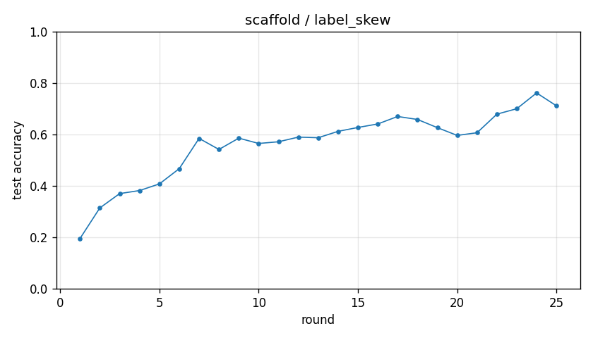

# Experiment report -- scaffold / label_skew

## Configuration

| Key | Value |
|---|---|
| algorithm | scaffold |
| partition | label_skew |
| num_clients | 10 |
| classes_per_client | 2 |
| alpha | 0.1 |
| rounds | 25 |
| local_epochs | 5 |
| local_lr | 0.01 |
| batch_size | 64 |
| participation_rate | 1.0 |
| mu | 0.01 |
| global_lr | 1.0 |
| seed | 0 |
| device | cuda |
| output_dir | results/scaffold_labelskew_2 |
| log_every | 1 |

## Partition

- Number of clients with data: **10**
- Samples per client: min=3019, median=4673, max=12593, total=60000

## Results

- Final test accuracy (round 25): **0.7112**
- Best test accuracy: **0.7613** at round 24
- Final test loss: 0.8922
- Rounds to 0.90 acc: not reached
- Rounds to 0.95 acc: not reached
- Wall clock: 675.2s

## Per-round history

| Round | Test acc | Test loss | Clients |
|---|---|---|---|
| 1 | 0.1951 | 2.4097 | 10 |
| 2 | 0.3142 | 3.5864 | 10 |
| 3 | 0.3700 | 3.0286 | 10 |
| 4 | 0.3818 | 2.1126 | 10 |
| 5 | 0.4076 | 1.9200 | 10 |
| 6 | 0.4669 | 1.6865 | 10 |
| 7 | 0.5846 | 1.2130 | 10 |
| 8 | 0.5416 | 1.5023 | 10 |
| 9 | 0.5856 | 1.3221 | 10 |
| 10 | 0.5649 | 1.5156 | 10 |
| 11 | 0.5715 | 1.4891 | 10 |
| 12 | 0.5896 | 1.4396 | 10 |
| 13 | 0.5872 | 1.5721 | 10 |
| 14 | 0.6120 | 1.2405 | 10 |
| 15 | 0.6271 | 1.1809 | 10 |
| 16 | 0.6407 | 1.1387 | 10 |
| 17 | 0.6698 | 0.9001 | 10 |
| 18 | 0.6582 | 0.9842 | 10 |
| 19 | 0.6264 | 1.2388 | 10 |
| 20 | 0.5962 | 1.5905 | 10 |
| 21 | 0.6066 | 1.3792 | 10 |
| 22 | 0.6789 | 0.9209 | 10 |
| 23 | 0.6999 | 0.8653 | 10 |
| 24 | 0.7613 | 0.6463 | 10 |
| 25 | 0.7112 | 0.8922 | 10 |

