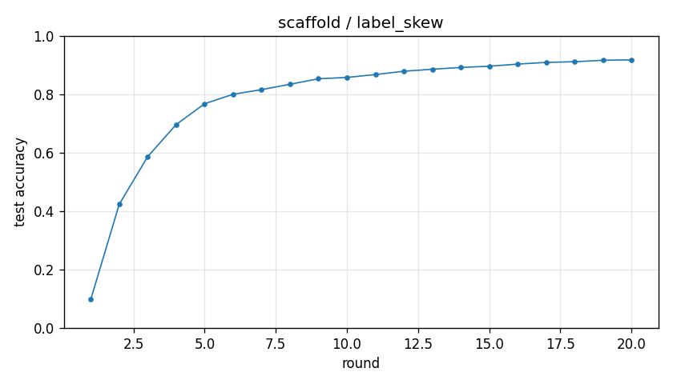

# Experiment report -- scaffold / label_skew

## Configuration

| Key | Value |
|---|---|
| algorithm | scaffold |
| partition | label_skew |
| num_clients | 100 |
| classes_per_client | 2 |
| alpha | 0.1 |
| rounds | 20 |
| local_epochs | 5 |
| local_lr | 0.01 |
| batch_size | 64 |
| participation_rate | 1.0 |
| mu | 0.01 |
| seed | 0 |
| device | cuda |
| output_dir | results/scaffold_labelskew_2_K100 |
| log_every | 1 |

## Partition

- Number of clients with data: **100**
- Samples per client: min=470, median=601, max=734, total=60000

## Results

- Final test accuracy (round 20): **0.9179**
- Best test accuracy: **0.9179** at round 20
- Final test loss: 0.2891
- Rounds to 0.90 acc: 16
- Rounds to 0.95 acc: not reached
- Wall clock: 522.9s

## Per-round history

| Round | Test acc | Test loss | Clients |
|---|---|---|---|
| 1 | 0.0979 | 2.3003 | 100 |
| 2 | 0.4234 | 1.9037 | 100 |
| 3 | 0.5866 | 1.4826 | 100 |
| 4 | 0.6964 | 1.1230 | 100 |
| 5 | 0.7676 | 0.8796 | 100 |
| 6 | 0.8001 | 0.7281 | 100 |
| 7 | 0.8159 | 0.6387 | 100 |
| 8 | 0.8343 | 0.5700 | 100 |
| 9 | 0.8531 | 0.5204 | 100 |
| 10 | 0.8576 | 0.4953 | 100 |
| 11 | 0.8675 | 0.4661 | 100 |
| 12 | 0.8789 | 0.4321 | 100 |
| 13 | 0.8857 | 0.4045 | 100 |
| 14 | 0.8918 | 0.3826 | 100 |
| 15 | 0.8960 | 0.3640 | 100 |
| 16 | 0.9033 | 0.3421 | 100 |
| 17 | 0.9091 | 0.3260 | 100 |
| 18 | 0.9114 | 0.3133 | 100 |
| 19 | 0.9164 | 0.2983 | 100 |
| 20 | 0.9179 | 0.2891 | 100 |

