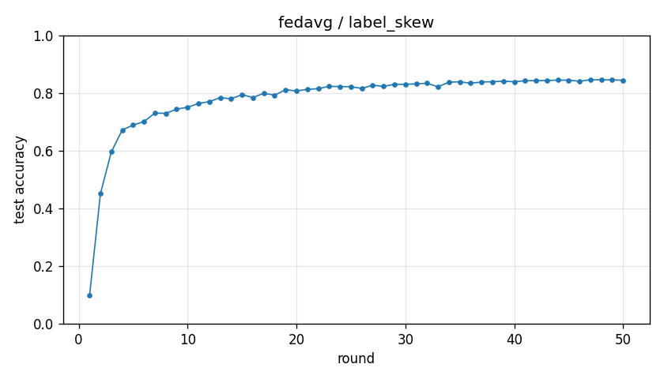

# Experiment report -- fedavg / label_skew

## Configuration

| Key | Value |
|---|---|
| algorithm | fedavg |
| partition | label_skew |
| num_clients | 10 |
| classes_per_client | 2 |
| alpha | 0.1 |
| rounds | 50 |
| local_epochs | 5 |
| local_lr | 0.01 |
| batch_size | 64 |
| participation_rate | 1.0 |
| mu | 0.01 |
| seed | 0 |
| device | cuda |
| output_dir | results/unified/u_fedavg_K10 |
| log_every | 1 |

## Partition

- Number of clients with data: **10**
- Samples per client: min=3019, median=4354, max=12593, total=54077

## Results

- Final test accuracy (round 50): **0.8442**
- Best test accuracy: **0.8463** at round 47
- Final test loss: 1.2891
- Rounds to 0.90 acc: not reached
- Rounds to 0.95 acc: not reached
- Wall clock: 1192.8s

## Per-round history

| Round | Test acc | Test loss | Clients |
|---|---|---|---|
| 1 | 0.0974 | 2.5256 | 10 |
| 2 | 0.4510 | 1.8819 | 10 |
| 3 | 0.5959 | 1.6046 | 10 |
| 4 | 0.6719 | 1.4316 | 10 |
| 5 | 0.6888 | 1.3704 | 10 |
| 6 | 0.7012 | 1.3482 | 10 |
| 7 | 0.7305 | 1.3268 | 10 |
| 8 | 0.7296 | 1.3120 | 10 |
| 9 | 0.7443 | 1.2978 | 10 |
| 10 | 0.7507 | 1.2718 | 10 |
| 11 | 0.7637 | 1.2814 | 10 |
| 12 | 0.7703 | 1.2650 | 10 |
| 13 | 0.7841 | 1.2498 | 10 |
| 14 | 0.7799 | 1.2694 | 10 |
| 15 | 0.7947 | 1.2636 | 10 |
| 16 | 0.7843 | 1.2480 | 10 |
| 17 | 0.7994 | 1.2417 | 10 |
| 18 | 0.7927 | 1.2354 | 10 |
| 19 | 0.8115 | 1.2138 | 10 |
| 20 | 0.8072 | 1.2047 | 10 |
| 21 | 0.8127 | 1.2122 | 10 |
| 22 | 0.8152 | 1.1611 | 10 |
| 23 | 0.8232 | 1.1749 | 10 |
| 24 | 0.8225 | 1.1964 | 10 |
| 25 | 0.8220 | 1.2078 | 10 |
| 26 | 0.8160 | 1.1867 | 10 |
| 27 | 0.8274 | 1.1884 | 10 |
| 28 | 0.8229 | 1.2062 | 10 |
| 29 | 0.8305 | 1.2120 | 10 |
| 30 | 0.8302 | 1.2348 | 10 |
| 31 | 0.8319 | 1.2346 | 10 |
| 32 | 0.8340 | 1.2483 | 10 |
| 33 | 0.8218 | 1.1817 | 10 |
| 34 | 0.8376 | 1.1842 | 10 |
| 35 | 0.8391 | 1.2013 | 10 |
| 36 | 0.8341 | 1.2355 | 10 |
| 37 | 0.8383 | 1.2397 | 10 |
| 38 | 0.8392 | 1.2583 | 10 |
| 39 | 0.8413 | 1.2684 | 10 |
| 40 | 0.8390 | 1.2489 | 10 |
| 41 | 0.8427 | 1.2567 | 10 |
| 42 | 0.8432 | 1.2728 | 10 |
| 43 | 0.8434 | 1.2857 | 10 |
| 44 | 0.8449 | 1.2613 | 10 |
| 45 | 0.8446 | 1.2795 | 10 |
| 46 | 0.8409 | 1.3065 | 10 |
| 47 | 0.8463 | 1.2597 | 10 |
| 48 | 0.8457 | 1.2803 | 10 |
| 49 | 0.8457 | 1.2579 | 10 |
| 50 | 0.8442 | 1.2891 | 10 |

