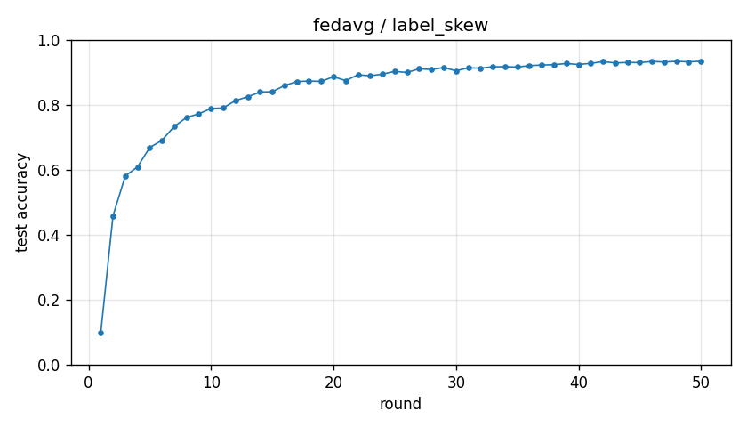

# Experiment report -- fedavg / label_skew

## Configuration

| Key | Value |
|---|---|
| algorithm | fedavg |
| partition | label_skew |
| num_clients | 10 |
| classes_per_client | 2 |
| alpha | 0.1 |
| rounds | 50 |
| local_epochs | 5 |
| local_lr | 0.01 |
| batch_size | 64 |
| participation_rate | 1.0 |
| mu | 0.01 |
| global_lr | 1.0 |
| seed | 0 |
| device | cuda |
| output_dir | results/unified/u_fedavg_K10 |
| log_every | 1 |

## Partition

- Number of clients with data: **10**
- Samples per client: min=3019, median=4673, max=12593, total=60000

## Results

- Final test accuracy (round 50): **0.9340**
- Best test accuracy: **0.9340** at round 50
- Final test loss: 0.2010
- Rounds to 0.90 acc: 25
- Rounds to 0.95 acc: not reached
- Wall clock: 1333.7s

## Per-round history

| Round | Test acc | Test loss | Clients |
|---|---|---|---|
| 1 | 0.0974 | 2.3356 | 10 |
| 2 | 0.4583 | 1.7186 | 10 |
| 3 | 0.5806 | 1.3548 | 10 |
| 4 | 0.6092 | 1.1879 | 10 |
| 5 | 0.6686 | 1.0247 | 10 |
| 6 | 0.6911 | 0.9074 | 10 |
| 7 | 0.7334 | 0.8175 | 10 |
| 8 | 0.7611 | 0.7131 | 10 |
| 9 | 0.7724 | 0.6743 | 10 |
| 10 | 0.7888 | 0.6090 | 10 |
| 11 | 0.7905 | 0.6113 | 10 |
| 12 | 0.8134 | 0.5483 | 10 |
| 13 | 0.8248 | 0.5105 | 10 |
| 14 | 0.8395 | 0.4755 | 10 |
| 15 | 0.8406 | 0.4615 | 10 |
| 16 | 0.8592 | 0.4223 | 10 |
| 17 | 0.8717 | 0.3961 | 10 |
| 18 | 0.8733 | 0.3866 | 10 |
| 19 | 0.8722 | 0.3776 | 10 |
| 20 | 0.8865 | 0.3578 | 10 |
| 21 | 0.8746 | 0.3653 | 10 |
| 22 | 0.8925 | 0.3382 | 10 |
| 23 | 0.8896 | 0.3331 | 10 |
| 24 | 0.8945 | 0.3232 | 10 |
| 25 | 0.9030 | 0.3064 | 10 |
| 26 | 0.8996 | 0.3072 | 10 |
| 27 | 0.9109 | 0.2870 | 10 |
| 28 | 0.9086 | 0.2846 | 10 |
| 29 | 0.9148 | 0.2696 | 10 |
| 30 | 0.9045 | 0.2856 | 10 |
| 31 | 0.9138 | 0.2702 | 10 |
| 32 | 0.9128 | 0.2666 | 10 |
| 33 | 0.9171 | 0.2563 | 10 |
| 34 | 0.9172 | 0.2531 | 10 |
| 35 | 0.9163 | 0.2530 | 10 |
| 36 | 0.9206 | 0.2457 | 10 |
| 37 | 0.9224 | 0.2380 | 10 |
| 38 | 0.9235 | 0.2373 | 10 |
| 39 | 0.9271 | 0.2294 | 10 |
| 40 | 0.9241 | 0.2313 | 10 |
| 41 | 0.9277 | 0.2248 | 10 |
| 42 | 0.9328 | 0.2137 | 10 |
| 43 | 0.9289 | 0.2190 | 10 |
| 44 | 0.9303 | 0.2141 | 10 |
| 45 | 0.9300 | 0.2141 | 10 |
| 46 | 0.9333 | 0.2099 | 10 |
| 47 | 0.9318 | 0.2104 | 10 |
| 48 | 0.9337 | 0.2046 | 10 |
| 49 | 0.9323 | 0.2056 | 10 |
| 50 | 0.9340 | 0.2010 | 10 |

