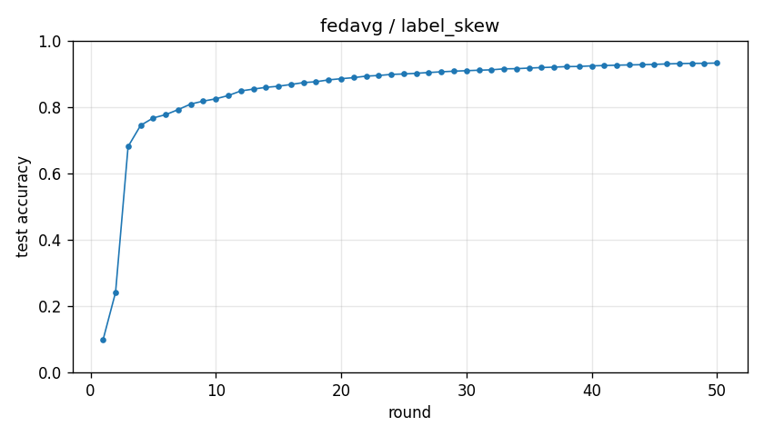

# Experiment report -- fedavg / label_skew

## Configuration

| Key | Value |
|---|---|
| algorithm | fedavg |
| partition | label_skew |
| num_clients | 100 |
| classes_per_client | 2 |
| alpha | 0.1 |
| rounds | 50 |
| local_epochs | 5 |
| local_lr | 0.01 |
| batch_size | 64 |
| participation_rate | 1.0 |
| mu | 0.01 |
| seed | 0 |
| device | cuda |
| output_dir | results/unified/u_fedavg_K100 |
| log_every | 1 |

## Partition

- Number of clients with data: **100**
- Samples per client: min=470, median=601, max=734, total=60000

## Results

- Final test accuracy (round 50): **0.9327**
- Best test accuracy: **0.9327** at round 50
- Final test loss: 0.2281
- Rounds to 0.90 acc: 26
- Rounds to 0.95 acc: not reached
- Wall clock: 1366.4s

## Per-round history

| Round | Test acc | Test loss | Clients |
|---|---|---|---|
| 1 | 0.0982 | 2.3061 | 100 |
| 2 | 0.2415 | 2.0077 | 100 |
| 3 | 0.6810 | 1.7174 | 100 |
| 4 | 0.7447 | 1.4766 | 100 |
| 5 | 0.7671 | 1.2750 | 100 |
| 6 | 0.7771 | 1.1124 | 100 |
| 7 | 0.7923 | 0.9807 | 100 |
| 8 | 0.8091 | 0.8757 | 100 |
| 9 | 0.8179 | 0.7942 | 100 |
| 10 | 0.8248 | 0.7303 | 100 |
| 11 | 0.8347 | 0.6764 | 100 |
| 12 | 0.8486 | 0.6298 | 100 |
| 13 | 0.8541 | 0.5927 | 100 |
| 14 | 0.8594 | 0.5593 | 100 |
| 15 | 0.8627 | 0.5309 | 100 |
| 16 | 0.8681 | 0.5040 | 100 |
| 17 | 0.8737 | 0.4801 | 100 |
| 18 | 0.8763 | 0.4622 | 100 |
| 19 | 0.8819 | 0.4437 | 100 |
| 20 | 0.8854 | 0.4277 | 100 |
| 21 | 0.8886 | 0.4122 | 100 |
| 22 | 0.8932 | 0.3968 | 100 |
| 23 | 0.8951 | 0.3865 | 100 |
| 24 | 0.8984 | 0.3752 | 100 |
| 25 | 0.8997 | 0.3642 | 100 |
| 26 | 0.9017 | 0.3542 | 100 |
| 27 | 0.9041 | 0.3447 | 100 |
| 28 | 0.9062 | 0.3367 | 100 |
| 29 | 0.9081 | 0.3287 | 100 |
| 30 | 0.9096 | 0.3209 | 100 |
| 31 | 0.9110 | 0.3139 | 100 |
| 32 | 0.9122 | 0.3071 | 100 |
| 33 | 0.9152 | 0.3012 | 100 |
| 34 | 0.9156 | 0.2955 | 100 |
| 35 | 0.9175 | 0.2901 | 100 |
| 36 | 0.9190 | 0.2844 | 100 |
| 37 | 0.9203 | 0.2793 | 100 |
| 38 | 0.9219 | 0.2739 | 100 |
| 39 | 0.9224 | 0.2701 | 100 |
| 40 | 0.9241 | 0.2645 | 100 |
| 41 | 0.9251 | 0.2606 | 100 |
| 42 | 0.9262 | 0.2571 | 100 |
| 43 | 0.9270 | 0.2533 | 100 |
| 44 | 0.9277 | 0.2492 | 100 |
| 45 | 0.9286 | 0.2458 | 100 |
| 46 | 0.9300 | 0.2414 | 100 |
| 47 | 0.9310 | 0.2379 | 100 |
| 48 | 0.9317 | 0.2346 | 100 |
| 49 | 0.9318 | 0.2311 | 100 |
| 50 | 0.9327 | 0.2281 | 100 |

