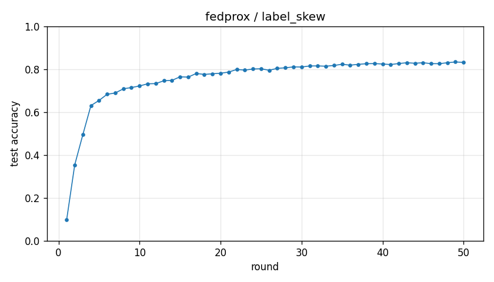

# Experiment report -- fedprox / label_skew

## Configuration

| Key | Value |
|---|---|
| algorithm | fedprox |
| partition | label_skew |
| num_clients | 10 |
| classes_per_client | 2 |
| alpha | 0.1 |
| rounds | 50 |
| local_epochs | 5 |
| local_lr | 0.01 |
| batch_size | 64 |
| participation_rate | 1.0 |
| mu | 0.1 |
| seed | 0 |
| device | cuda |
| output_dir | results/unified/u_fedprox_K10 |
| log_every | 1 |

## Partition

- Number of clients with data: **10**
- Samples per client: min=3019, median=4354, max=12593, total=54077

## Results

- Final test accuracy (round 50): **0.8320**
- Best test accuracy: **0.8339** at round 49
- Final test loss: 1.2643
- Rounds to 0.90 acc: not reached
- Rounds to 0.95 acc: not reached
- Wall clock: 1227.2s

## Per-round history

| Round | Test acc | Test loss | Clients |
|---|---|---|---|
| 1 | 0.0974 | 2.3498 | 10 |
| 2 | 0.3544 | 2.0238 | 10 |
| 3 | 0.4947 | 1.7546 | 10 |
| 4 | 0.6307 | 1.5563 | 10 |
| 5 | 0.6546 | 1.4706 | 10 |
| 6 | 0.6833 | 1.4225 | 10 |
| 7 | 0.6893 | 1.3961 | 10 |
| 8 | 0.7087 | 1.3665 | 10 |
| 9 | 0.7148 | 1.3666 | 10 |
| 10 | 0.7220 | 1.3380 | 10 |
| 11 | 0.7322 | 1.3389 | 10 |
| 12 | 0.7330 | 1.3343 | 10 |
| 13 | 0.7464 | 1.3105 | 10 |
| 14 | 0.7480 | 1.3141 | 10 |
| 15 | 0.7647 | 1.2972 | 10 |
| 16 | 0.7633 | 1.2940 | 10 |
| 17 | 0.7803 | 1.2776 | 10 |
| 18 | 0.7759 | 1.2721 | 10 |
| 19 | 0.7789 | 1.2763 | 10 |
| 20 | 0.7815 | 1.2657 | 10 |
| 21 | 0.7866 | 1.2766 | 10 |
| 22 | 0.7991 | 1.2308 | 10 |
| 23 | 0.7961 | 1.2357 | 10 |
| 24 | 0.8011 | 1.2506 | 10 |
| 25 | 0.8022 | 1.2620 | 10 |
| 26 | 0.7954 | 1.2600 | 10 |
| 27 | 0.8041 | 1.2576 | 10 |
| 28 | 0.8067 | 1.2656 | 10 |
| 29 | 0.8109 | 1.2678 | 10 |
| 30 | 0.8104 | 1.2866 | 10 |
| 31 | 0.8152 | 1.2837 | 10 |
| 32 | 0.8155 | 1.2917 | 10 |
| 33 | 0.8141 | 1.2551 | 10 |
| 34 | 0.8176 | 1.2676 | 10 |
| 35 | 0.8232 | 1.2552 | 10 |
| 36 | 0.8190 | 1.2803 | 10 |
| 37 | 0.8228 | 1.2840 | 10 |
| 38 | 0.8258 | 1.2850 | 10 |
| 39 | 0.8264 | 1.2999 | 10 |
| 40 | 0.8244 | 1.2866 | 10 |
| 41 | 0.8219 | 1.2699 | 10 |
| 42 | 0.8267 | 1.2770 | 10 |
| 43 | 0.8302 | 1.2905 | 10 |
| 44 | 0.8279 | 1.2784 | 10 |
| 45 | 0.8303 | 1.2782 | 10 |
| 46 | 0.8261 | 1.3014 | 10 |
| 47 | 0.8258 | 1.2450 | 10 |
| 48 | 0.8304 | 1.2534 | 10 |
| 49 | 0.8339 | 1.2395 | 10 |
| 50 | 0.8320 | 1.2643 | 10 |

