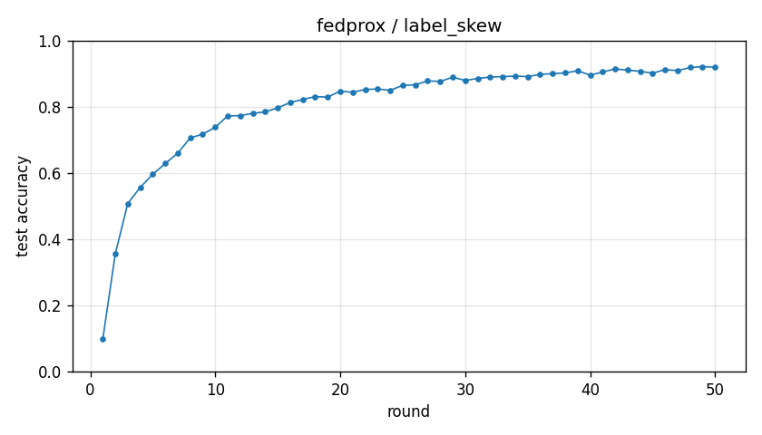

# Experiment report -- fedprox / label_skew

## Configuration

| Key | Value |
|---|---|
| algorithm | fedprox |
| partition | label_skew |
| num_clients | 10 |
| classes_per_client | 2 |
| alpha | 0.1 |
| rounds | 50 |
| local_epochs | 5 |
| local_lr | 0.01 |
| batch_size | 64 |
| participation_rate | 1.0 |
| mu | 0.1 |
| global_lr | 1.0 |
| seed | 0 |
| device | cuda |
| output_dir | results/unified/u_fedprox_K10 |
| log_every | 1 |

## Partition

- Number of clients with data: **10**
- Samples per client: min=3019, median=4673, max=12593, total=60000

## Results

- Final test accuracy (round 50): **0.9198**
- Best test accuracy: **0.9213** at round 49
- Final test loss: 0.2425
- Rounds to 0.90 acc: 37
- Rounds to 0.95 acc: not reached
- Wall clock: 1347.0s

## Per-round history

| Round | Test acc | Test loss | Clients |
|---|---|---|---|
| 1 | 0.0974 | 2.2711 | 10 |
| 2 | 0.3551 | 1.8857 | 10 |
| 3 | 0.5078 | 1.5331 | 10 |
| 4 | 0.5568 | 1.3472 | 10 |
| 5 | 0.5960 | 1.1924 | 10 |
| 6 | 0.6285 | 1.0649 | 10 |
| 7 | 0.6599 | 0.9868 | 10 |
| 8 | 0.7061 | 0.8614 | 10 |
| 9 | 0.7173 | 0.8246 | 10 |
| 10 | 0.7384 | 0.7633 | 10 |
| 11 | 0.7725 | 0.7083 | 10 |
| 12 | 0.7732 | 0.6798 | 10 |
| 13 | 0.7801 | 0.6496 | 10 |
| 14 | 0.7847 | 0.6161 | 10 |
| 15 | 0.7969 | 0.5829 | 10 |
| 16 | 0.8128 | 0.5420 | 10 |
| 17 | 0.8222 | 0.5113 | 10 |
| 18 | 0.8307 | 0.4847 | 10 |
| 19 | 0.8293 | 0.4777 | 10 |
| 20 | 0.8474 | 0.4393 | 10 |
| 21 | 0.8439 | 0.4410 | 10 |
| 22 | 0.8524 | 0.4201 | 10 |
| 23 | 0.8538 | 0.4123 | 10 |
| 24 | 0.8498 | 0.4132 | 10 |
| 25 | 0.8646 | 0.3851 | 10 |
| 26 | 0.8664 | 0.3757 | 10 |
| 27 | 0.8781 | 0.3548 | 10 |
| 28 | 0.8767 | 0.3523 | 10 |
| 29 | 0.8893 | 0.3333 | 10 |
| 30 | 0.8797 | 0.3428 | 10 |
| 31 | 0.8856 | 0.3331 | 10 |
| 32 | 0.8899 | 0.3228 | 10 |
| 33 | 0.8912 | 0.3188 | 10 |
| 34 | 0.8926 | 0.3143 | 10 |
| 35 | 0.8913 | 0.3140 | 10 |
| 36 | 0.8978 | 0.3011 | 10 |
| 37 | 0.9003 | 0.2929 | 10 |
| 38 | 0.9023 | 0.2907 | 10 |
| 39 | 0.9089 | 0.2758 | 10 |
| 40 | 0.8957 | 0.2957 | 10 |
| 41 | 0.9051 | 0.2800 | 10 |
| 42 | 0.9144 | 0.2612 | 10 |
| 43 | 0.9108 | 0.2686 | 10 |
| 44 | 0.9073 | 0.2748 | 10 |
| 45 | 0.9016 | 0.2823 | 10 |
| 46 | 0.9124 | 0.2626 | 10 |
| 47 | 0.9092 | 0.2647 | 10 |
| 48 | 0.9188 | 0.2488 | 10 |
| 49 | 0.9213 | 0.2427 | 10 |
| 50 | 0.9198 | 0.2425 | 10 |

