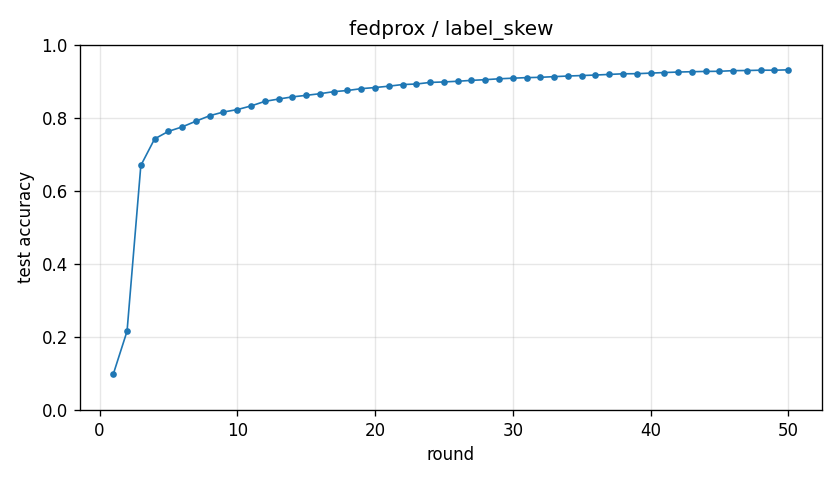

# Experiment report -- fedprox / label_skew

## Configuration

| Key | Value |
|---|---|
| algorithm | fedprox |
| partition | label_skew |
| num_clients | 100 |
| classes_per_client | 2 |
| alpha | 0.1 |
| rounds | 50 |
| local_epochs | 5 |
| local_lr | 0.01 |
| batch_size | 64 |
| participation_rate | 1.0 |
| mu | 0.1 |
| seed | 0 |
| device | cuda |
| output_dir | results/unified/u_fedprox_K100 |
| log_every | 1 |

## Partition

- Number of clients with data: **100**
- Samples per client: min=470, median=601, max=734, total=60000

## Results

- Final test accuracy (round 50): **0.9315**
- Best test accuracy: **0.9315** at round 50
- Final test loss: 0.2317
- Rounds to 0.90 acc: 26
- Rounds to 0.95 acc: not reached
- Wall clock: 1389.1s

## Per-round history

| Round | Test acc | Test loss | Clients |
|---|---|---|---|
| 1 | 0.0983 | 2.3046 | 100 |
| 2 | 0.2160 | 2.0195 | 100 |
| 3 | 0.6696 | 1.7324 | 100 |
| 4 | 0.7424 | 1.4924 | 100 |
| 5 | 0.7630 | 1.2914 | 100 |
| 6 | 0.7752 | 1.1284 | 100 |
| 7 | 0.7909 | 0.9963 | 100 |
| 8 | 0.8059 | 0.8903 | 100 |
| 9 | 0.8160 | 0.8074 | 100 |
| 10 | 0.8226 | 0.7426 | 100 |
| 11 | 0.8326 | 0.6878 | 100 |
| 12 | 0.8451 | 0.6401 | 100 |
| 13 | 0.8515 | 0.6025 | 100 |
| 14 | 0.8574 | 0.5686 | 100 |
| 15 | 0.8616 | 0.5400 | 100 |
| 16 | 0.8661 | 0.5132 | 100 |
| 17 | 0.8717 | 0.4882 | 100 |
| 18 | 0.8749 | 0.4699 | 100 |
| 19 | 0.8799 | 0.4512 | 100 |
| 20 | 0.8830 | 0.4347 | 100 |
| 21 | 0.8867 | 0.4187 | 100 |
| 22 | 0.8912 | 0.4037 | 100 |
| 23 | 0.8926 | 0.3931 | 100 |
| 24 | 0.8970 | 0.3813 | 100 |
| 25 | 0.8983 | 0.3704 | 100 |
| 26 | 0.9002 | 0.3602 | 100 |
| 27 | 0.9026 | 0.3503 | 100 |
| 28 | 0.9045 | 0.3423 | 100 |
| 29 | 0.9069 | 0.3339 | 100 |
| 30 | 0.9086 | 0.3259 | 100 |
| 31 | 0.9101 | 0.3190 | 100 |
| 32 | 0.9110 | 0.3120 | 100 |
| 33 | 0.9128 | 0.3060 | 100 |
| 34 | 0.9145 | 0.3002 | 100 |
| 35 | 0.9158 | 0.2948 | 100 |
| 36 | 0.9172 | 0.2888 | 100 |
| 37 | 0.9189 | 0.2836 | 100 |
| 38 | 0.9206 | 0.2782 | 100 |
| 39 | 0.9209 | 0.2743 | 100 |
| 40 | 0.9225 | 0.2688 | 100 |
| 41 | 0.9240 | 0.2646 | 100 |
| 42 | 0.9254 | 0.2611 | 100 |
| 43 | 0.9263 | 0.2573 | 100 |
| 44 | 0.9271 | 0.2531 | 100 |
| 45 | 0.9275 | 0.2496 | 100 |
| 46 | 0.9292 | 0.2451 | 100 |
| 47 | 0.9296 | 0.2416 | 100 |
| 48 | 0.9305 | 0.2381 | 100 |
| 49 | 0.9304 | 0.2347 | 100 |
| 50 | 0.9315 | 0.2317 | 100 |

