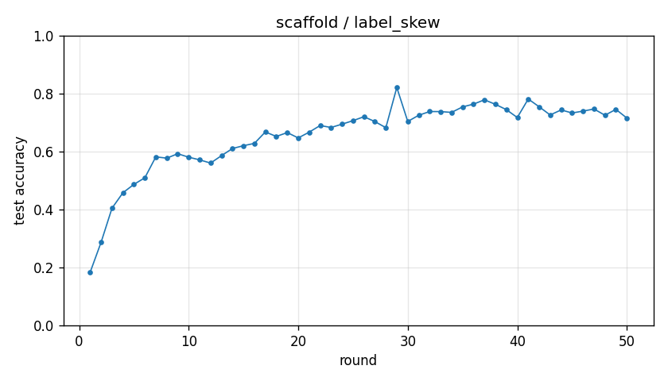

# Experiment report -- scaffold / label_skew

## Configuration

| Key | Value |
|---|---|
| algorithm | scaffold |
| partition | label_skew |
| num_clients | 10 |
| classes_per_client | 2 |
| alpha | 0.1 |
| rounds | 50 |
| local_epochs | 5 |
| local_lr | 0.01 |
| batch_size | 64 |
| participation_rate | 1.0 |
| mu | 0.01 |
| seed | 0 |
| device | cuda |
| output_dir | results/unified/u_scaffold_K10 |
| log_every | 1 |

## Partition

- Number of clients with data: **10**
- Samples per client: min=3019, median=4354, max=12593, total=54077

## Results

- Final test accuracy (round 50): **0.7155**
- Best test accuracy: **0.8210** at round 29
- Final test loss: 1.3119
- Rounds to 0.90 acc: not reached
- Rounds to 0.95 acc: not reached
- Wall clock: 1217.0s

## Per-round history

| Round | Test acc | Test loss | Clients |
|---|---|---|---|
| 1 | 0.1830 | 2.5586 | 10 |
| 2 | 0.2865 | 3.5167 | 10 |
| 3 | 0.4046 | 2.6978 | 10 |
| 4 | 0.4579 | 2.2500 | 10 |
| 5 | 0.4867 | 1.9411 | 10 |
| 6 | 0.5095 | 1.9054 | 10 |
| 7 | 0.5816 | 1.6728 | 10 |
| 8 | 0.5772 | 1.7750 | 10 |
| 9 | 0.5924 | 1.8077 | 10 |
| 10 | 0.5805 | 1.9834 | 10 |
| 11 | 0.5713 | 2.1221 | 10 |
| 12 | 0.5602 | 2.0885 | 10 |
| 13 | 0.5859 | 2.0430 | 10 |
| 14 | 0.6105 | 1.8322 | 10 |
| 15 | 0.6201 | 1.7843 | 10 |
| 16 | 0.6281 | 1.7394 | 10 |
| 17 | 0.6676 | 1.5144 | 10 |
| 18 | 0.6520 | 1.6612 | 10 |
| 19 | 0.6654 | 1.5907 | 10 |
| 20 | 0.6469 | 1.7196 | 10 |
| 21 | 0.6668 | 1.5352 | 10 |
| 22 | 0.6897 | 1.4629 | 10 |
| 23 | 0.6830 | 1.5107 | 10 |
| 24 | 0.6944 | 1.4854 | 10 |
| 25 | 0.7065 | 1.4472 | 10 |
| 26 | 0.7201 | 1.4094 | 10 |
| 27 | 0.7033 | 1.5241 | 10 |
| 28 | 0.6823 | 1.6680 | 10 |
| 29 | 0.8210 | 1.1009 | 10 |
| 30 | 0.7037 | 1.4630 | 10 |
| 31 | 0.7251 | 1.3414 | 10 |
| 32 | 0.7380 | 1.2721 | 10 |
| 33 | 0.7377 | 1.3344 | 10 |
| 34 | 0.7350 | 1.4593 | 10 |
| 35 | 0.7539 | 1.4678 | 10 |
| 36 | 0.7635 | 1.4541 | 10 |
| 37 | 0.7784 | 1.3750 | 10 |
| 38 | 0.7628 | 1.4320 | 10 |
| 39 | 0.7445 | 1.5565 | 10 |
| 40 | 0.7173 | 1.6839 | 10 |
| 41 | 0.7812 | 1.2416 | 10 |
| 42 | 0.7542 | 1.2787 | 10 |
| 43 | 0.7261 | 1.2973 | 10 |
| 44 | 0.7435 | 1.1484 | 10 |
| 45 | 0.7330 | 1.1666 | 10 |
| 46 | 0.7394 | 1.1791 | 10 |
| 47 | 0.7467 | 1.1186 | 10 |
| 48 | 0.7252 | 1.2408 | 10 |
| 49 | 0.7454 | 1.1368 | 10 |
| 50 | 0.7155 | 1.3119 | 10 |

