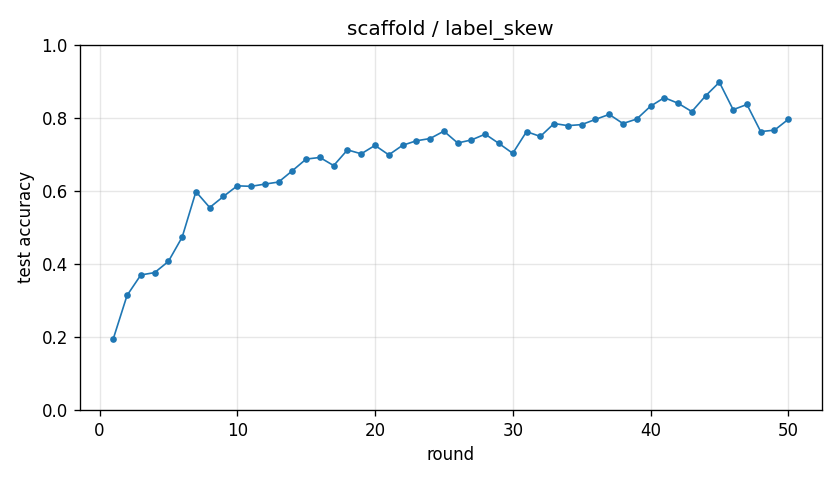

# Experiment report -- scaffold / label_skew

## Configuration

| Key | Value |
|---|---|
| algorithm | scaffold |
| partition | label_skew |
| num_clients | 10 |
| classes_per_client | 2 |
| alpha | 0.1 |
| rounds | 50 |
| local_epochs | 5 |
| local_lr | 0.01 |
| batch_size | 64 |
| participation_rate | 1.0 |
| mu | 0.01 |
| global_lr | 1.0 |
| seed | 0 |
| device | cuda |
| output_dir | results/unified/u_scaffold_K10 |
| log_every | 1 |

## Partition

- Number of clients with data: **10**
- Samples per client: min=3019, median=4673, max=12593, total=60000

## Results

- Final test accuracy (round 50): **0.7959**
- Best test accuracy: **0.8975** at round 45
- Final test loss: 0.5604
- Rounds to 0.90 acc: not reached
- Rounds to 0.95 acc: not reached
- Wall clock: 1383.2s

## Per-round history

| Round | Test acc | Test loss | Clients |
|---|---|---|---|
| 1 | 0.1951 | 2.4097 | 10 |
| 2 | 0.3139 | 3.5892 | 10 |
| 3 | 0.3699 | 3.0246 | 10 |
| 4 | 0.3763 | 2.2045 | 10 |
| 5 | 0.4069 | 1.9302 | 10 |
| 6 | 0.4734 | 1.5741 | 10 |
| 7 | 0.5979 | 1.1679 | 10 |
| 8 | 0.5545 | 1.4050 | 10 |
| 9 | 0.5849 | 1.2946 | 10 |
| 10 | 0.6139 | 1.2676 | 10 |
| 11 | 0.6125 | 1.2592 | 10 |
| 12 | 0.6186 | 1.3673 | 10 |
| 13 | 0.6243 | 1.2943 | 10 |
| 14 | 0.6552 | 1.0925 | 10 |
| 15 | 0.6871 | 0.8924 | 10 |
| 16 | 0.6916 | 0.9144 | 10 |
| 17 | 0.6693 | 1.0481 | 10 |
| 18 | 0.7123 | 0.8816 | 10 |
| 19 | 0.7016 | 0.9408 | 10 |
| 20 | 0.7246 | 0.8215 | 10 |
| 21 | 0.6987 | 0.9821 | 10 |
| 22 | 0.7248 | 0.8323 | 10 |
| 23 | 0.7372 | 0.8075 | 10 |
| 24 | 0.7434 | 0.7664 | 10 |
| 25 | 0.7636 | 0.6602 | 10 |
| 26 | 0.7312 | 0.7933 | 10 |
| 27 | 0.7395 | 0.7779 | 10 |
| 28 | 0.7554 | 0.7186 | 10 |
| 29 | 0.7298 | 0.7892 | 10 |
| 30 | 0.7029 | 0.9480 | 10 |
| 31 | 0.7623 | 0.6859 | 10 |
| 32 | 0.7491 | 0.7579 | 10 |
| 33 | 0.7845 | 0.6131 | 10 |
| 34 | 0.7787 | 0.6412 | 10 |
| 35 | 0.7815 | 0.6339 | 10 |
| 36 | 0.7957 | 0.5787 | 10 |
| 37 | 0.8094 | 0.5570 | 10 |
| 38 | 0.7845 | 0.6436 | 10 |
| 39 | 0.7968 | 0.6093 | 10 |
| 40 | 0.8318 | 0.4999 | 10 |
| 41 | 0.8553 | 0.4269 | 10 |
| 42 | 0.8400 | 0.4807 | 10 |
| 43 | 0.8172 | 0.5698 | 10 |
| 44 | 0.8602 | 0.4115 | 10 |
| 45 | 0.8975 | 0.3104 | 10 |
| 46 | 0.8224 | 0.5032 | 10 |
| 47 | 0.8366 | 0.4538 | 10 |
| 48 | 0.7624 | 0.6553 | 10 |
| 49 | 0.7663 | 0.6576 | 10 |
| 50 | 0.7959 | 0.5604 | 10 |

