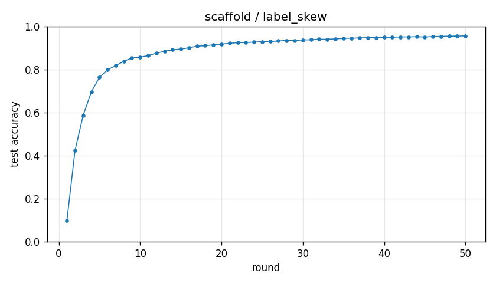

# Experiment report -- scaffold / label_skew

## Configuration

| Key | Value |
|---|---|
| algorithm | scaffold |
| partition | label_skew |
| num_clients | 100 |
| classes_per_client | 2 |
| alpha | 0.1 |
| rounds | 50 |
| local_epochs | 5 |
| local_lr | 0.01 |
| batch_size | 64 |
| participation_rate | 1.0 |
| mu | 0.01 |
| seed | 0 |
| device | cuda |
| output_dir | results/unified/u_scaffold_K100 |
| log_every | 1 |

## Partition

- Number of clients with data: **100**
- Samples per client: min=470, median=601, max=734, total=60000

## Results

- Final test accuracy (round 50): **0.9562**
- Best test accuracy: **0.9562** at round 50
- Final test loss: 0.1472
- Rounds to 0.90 acc: 16
- Rounds to 0.95 acc: 42
- Wall clock: 1580.2s

## Per-round history

| Round | Test acc | Test loss | Clients |
|---|---|---|---|
| 1 | 0.0979 | 2.3003 | 100 |
| 2 | 0.4239 | 1.9035 | 100 |
| 3 | 0.5869 | 1.4825 | 100 |
| 4 | 0.6952 | 1.1232 | 100 |
| 5 | 0.7632 | 0.8810 | 100 |
| 6 | 0.7993 | 0.7290 | 100 |
| 7 | 0.8175 | 0.6379 | 100 |
| 8 | 0.8384 | 0.5657 | 100 |
| 9 | 0.8535 | 0.5201 | 100 |
| 10 | 0.8573 | 0.4969 | 100 |
| 11 | 0.8646 | 0.4690 | 100 |
| 12 | 0.8759 | 0.4364 | 100 |
| 13 | 0.8846 | 0.4087 | 100 |
| 14 | 0.8915 | 0.3839 | 100 |
| 15 | 0.8949 | 0.3657 | 100 |
| 16 | 0.9011 | 0.3458 | 100 |
| 17 | 0.9083 | 0.3286 | 100 |
| 18 | 0.9109 | 0.3154 | 100 |
| 19 | 0.9142 | 0.3034 | 100 |
| 20 | 0.9178 | 0.2907 | 100 |
| 21 | 0.9216 | 0.2796 | 100 |
| 22 | 0.9247 | 0.2695 | 100 |
| 23 | 0.9253 | 0.2633 | 100 |
| 24 | 0.9273 | 0.2569 | 100 |
| 25 | 0.9291 | 0.2510 | 100 |
| 26 | 0.9302 | 0.2447 | 100 |
| 27 | 0.9324 | 0.2366 | 100 |
| 28 | 0.9351 | 0.2262 | 100 |
| 29 | 0.9351 | 0.2207 | 100 |
| 30 | 0.9373 | 0.2159 | 100 |
| 31 | 0.9381 | 0.2121 | 100 |
| 32 | 0.9406 | 0.2068 | 100 |
| 33 | 0.9404 | 0.2050 | 100 |
| 34 | 0.9425 | 0.1994 | 100 |
| 35 | 0.9445 | 0.1932 | 100 |
| 36 | 0.9455 | 0.1892 | 100 |
| 37 | 0.9468 | 0.1860 | 100 |
| 38 | 0.9480 | 0.1820 | 100 |
| 39 | 0.9484 | 0.1786 | 100 |
| 40 | 0.9499 | 0.1739 | 100 |
| 41 | 0.9499 | 0.1709 | 100 |
| 42 | 0.9513 | 0.1681 | 100 |
| 43 | 0.9515 | 0.1666 | 100 |
| 44 | 0.9523 | 0.1637 | 100 |
| 45 | 0.9507 | 0.1643 | 100 |
| 46 | 0.9534 | 0.1576 | 100 |
| 47 | 0.9541 | 0.1541 | 100 |
| 48 | 0.9550 | 0.1504 | 100 |
| 49 | 0.9552 | 0.1488 | 100 |
| 50 | 0.9562 | 0.1472 | 100 |

