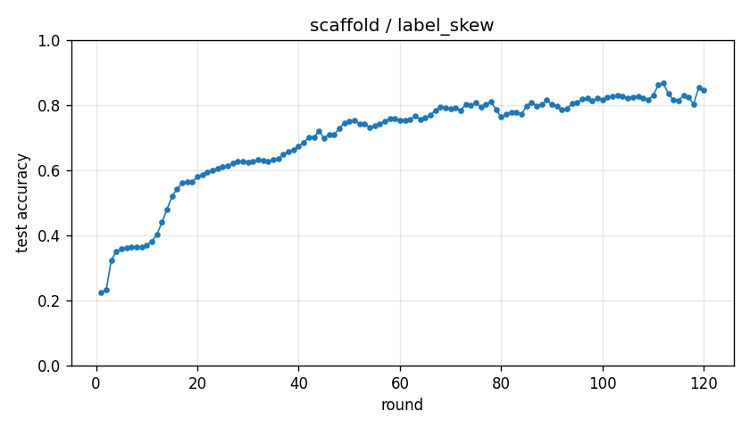

# Experiment report -- scaffold / label_skew

## Configuration

| Key | Value |
|---|---|
| algorithm | scaffold |
| partition | label_skew |
| num_clients | 10 |
| classes_per_client | 2 |
| alpha | 0.1 |
| rounds | 120 |
| local_epochs | 5 |
| local_lr | 0.01 |
| batch_size | 64 |
| participation_rate | 1.0 |
| mu | 0.01 |
| global_lr | 0.5 |
| seed | 0 |
| device | cuda |
| output_dir | results/unified/u_scaffold_K10_etag0.5 |
| log_every | 1 |

## Partition

- Number of clients with data: **10**
- Samples per client: min=3019, median=4673, max=12593, total=60000

## Results

- Final test accuracy (round 120): **0.8462**
- Best test accuracy: **0.8682** at round 112
- Final test loss: 0.4577
- Rounds to 0.90 acc: not reached
- Rounds to 0.95 acc: not reached
- Wall clock: 3311.4s

## Per-round history

| Round | Test acc | Test loss | Clients |
|---|---|---|---|
| 1 | 0.2256 | 2.2469 | 10 |
| 2 | 0.2328 | 2.2216 | 10 |
| 3 | 0.3233 | 2.4606 | 10 |
| 4 | 0.3507 | 2.6231 | 10 |
| 5 | 0.3577 | 2.6115 | 10 |
| 6 | 0.3621 | 2.6682 | 10 |
| 7 | 0.3646 | 2.7661 | 10 |
| 8 | 0.3640 | 2.8981 | 10 |
| 9 | 0.3653 | 2.7578 | 10 |
| 10 | 0.3694 | 2.7285 | 10 |
| 11 | 0.3817 | 2.5079 | 10 |
| 12 | 0.4027 | 2.3307 | 10 |
| 13 | 0.4399 | 2.0780 | 10 |
| 14 | 0.4803 | 1.8821 | 10 |
| 15 | 0.5197 | 1.7037 | 10 |
| 16 | 0.5421 | 1.6826 | 10 |
| 17 | 0.5601 | 1.5303 | 10 |
| 18 | 0.5638 | 1.5267 | 10 |
| 19 | 0.5649 | 1.5172 | 10 |
| 20 | 0.5795 | 1.4843 | 10 |
| 21 | 0.5853 | 1.4624 | 10 |
| 22 | 0.5949 | 1.4511 | 10 |
| 23 | 0.5994 | 1.4405 | 10 |
| 24 | 0.6064 | 1.4385 | 10 |
| 25 | 0.6110 | 1.3634 | 10 |
| 26 | 0.6140 | 1.3662 | 10 |
| 27 | 0.6209 | 1.3094 | 10 |
| 28 | 0.6279 | 1.2935 | 10 |
| 29 | 0.6263 | 1.2737 | 10 |
| 30 | 0.6250 | 1.3037 | 10 |
| 31 | 0.6270 | 1.2991 | 10 |
| 32 | 0.6316 | 1.2888 | 10 |
| 33 | 0.6288 | 1.3024 | 10 |
| 34 | 0.6278 | 1.2946 | 10 |
| 35 | 0.6328 | 1.2777 | 10 |
| 36 | 0.6363 | 1.2690 | 10 |
| 37 | 0.6488 | 1.1813 | 10 |
| 38 | 0.6563 | 1.1328 | 10 |
| 39 | 0.6617 | 1.1260 | 10 |
| 40 | 0.6734 | 1.0432 | 10 |
| 41 | 0.6859 | 0.9607 | 10 |
| 42 | 0.7007 | 0.8877 | 10 |
| 43 | 0.6998 | 0.8800 | 10 |
| 44 | 0.7210 | 0.7843 | 10 |
| 45 | 0.6992 | 0.8900 | 10 |
| 46 | 0.7100 | 0.8255 | 10 |
| 47 | 0.7100 | 0.8346 | 10 |
| 48 | 0.7273 | 0.7552 | 10 |
| 49 | 0.7460 | 0.6773 | 10 |
| 50 | 0.7507 | 0.6633 | 10 |
| 51 | 0.7530 | 0.6559 | 10 |
| 52 | 0.7426 | 0.7000 | 10 |
| 53 | 0.7433 | 0.6971 | 10 |
| 54 | 0.7318 | 0.7405 | 10 |
| 55 | 0.7362 | 0.7182 | 10 |
| 56 | 0.7415 | 0.6983 | 10 |
| 57 | 0.7516 | 0.6742 | 10 |
| 58 | 0.7577 | 0.6514 | 10 |
| 59 | 0.7588 | 0.6540 | 10 |
| 60 | 0.7525 | 0.6811 | 10 |
| 61 | 0.7544 | 0.6783 | 10 |
| 62 | 0.7547 | 0.6799 | 10 |
| 63 | 0.7662 | 0.6326 | 10 |
| 64 | 0.7566 | 0.6641 | 10 |
| 65 | 0.7609 | 0.6602 | 10 |
| 66 | 0.7696 | 0.6359 | 10 |
| 67 | 0.7842 | 0.5975 | 10 |
| 68 | 0.7944 | 0.5647 | 10 |
| 69 | 0.7918 | 0.5789 | 10 |
| 70 | 0.7895 | 0.5999 | 10 |
| 71 | 0.7906 | 0.6079 | 10 |
| 72 | 0.7833 | 0.6359 | 10 |
| 73 | 0.8021 | 0.5689 | 10 |
| 74 | 0.7990 | 0.5810 | 10 |
| 75 | 0.8077 | 0.5594 | 10 |
| 76 | 0.7937 | 0.6108 | 10 |
| 77 | 0.8020 | 0.5814 | 10 |
| 78 | 0.8102 | 0.5518 | 10 |
| 79 | 0.7857 | 0.6317 | 10 |
| 80 | 0.7630 | 0.7231 | 10 |
| 81 | 0.7729 | 0.7056 | 10 |
| 82 | 0.7779 | 0.6765 | 10 |
| 83 | 0.7772 | 0.6768 | 10 |
| 84 | 0.7730 | 0.6767 | 10 |
| 85 | 0.7960 | 0.5941 | 10 |
| 86 | 0.8083 | 0.5438 | 10 |
| 87 | 0.7979 | 0.5848 | 10 |
| 88 | 0.8021 | 0.5809 | 10 |
| 89 | 0.8150 | 0.5308 | 10 |
| 90 | 0.8026 | 0.5802 | 10 |
| 91 | 0.7976 | 0.5987 | 10 |
| 92 | 0.7848 | 0.6471 | 10 |
| 93 | 0.7884 | 0.6345 | 10 |
| 94 | 0.8047 | 0.5720 | 10 |
| 95 | 0.8074 | 0.5602 | 10 |
| 96 | 0.8182 | 0.5337 | 10 |
| 97 | 0.8208 | 0.5305 | 10 |
| 98 | 0.8132 | 0.5656 | 10 |
| 99 | 0.8205 | 0.5463 | 10 |
| 100 | 0.8166 | 0.5598 | 10 |
| 101 | 0.8236 | 0.5405 | 10 |
| 102 | 0.8265 | 0.5319 | 10 |
| 103 | 0.8306 | 0.5222 | 10 |
| 104 | 0.8283 | 0.5262 | 10 |
| 105 | 0.8219 | 0.5532 | 10 |
| 106 | 0.8247 | 0.5432 | 10 |
| 107 | 0.8273 | 0.5350 | 10 |
| 108 | 0.8220 | 0.5517 | 10 |
| 109 | 0.8170 | 0.5695 | 10 |
| 110 | 0.8293 | 0.5227 | 10 |
| 111 | 0.8612 | 0.4096 | 10 |
| 112 | 0.8682 | 0.3904 | 10 |
| 113 | 0.8349 | 0.4962 | 10 |
| 114 | 0.8155 | 0.5633 | 10 |
| 115 | 0.8139 | 0.5781 | 10 |
| 116 | 0.8298 | 0.5185 | 10 |
| 117 | 0.8237 | 0.5400 | 10 |
| 118 | 0.8034 | 0.6219 | 10 |
| 119 | 0.8540 | 0.4361 | 10 |
| 120 | 0.8462 | 0.4577 | 10 |

