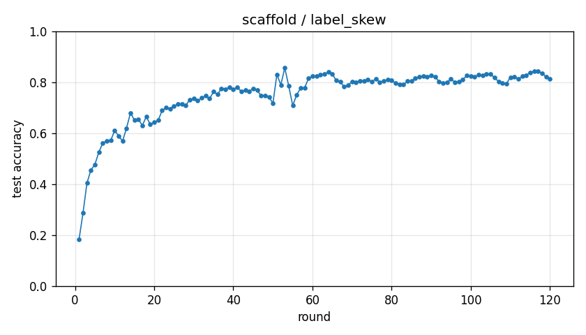

# Experiment report -- scaffold / label_skew

## Configuration

| Key | Value |
|---|---|
| algorithm | scaffold |
| partition | label_skew |
| num_clients | 10 |
| classes_per_client | 2 |
| alpha | 0.1 |
| rounds | 120 |
| local_epochs | 5 |
| local_lr | 0.01 |
| batch_size | 64 |
| participation_rate | 1.0 |
| mu | 0.01 |
| seed | 0 |
| device | cuda |
| output_dir | results/unified/u_scaffold_K10_long |
| log_every | 1 |

## Partition

- Number of clients with data: **10**
- Samples per client: min=3019, median=4354, max=12593, total=54077

## Results

- Final test accuracy (round 120): **0.8144**
- Best test accuracy: **0.8565** at round 53
- Final test loss: 1.5196
- Rounds to 0.90 acc: not reached
- Rounds to 0.95 acc: not reached
- Wall clock: 2921.2s

## Per-round history

| Round | Test acc | Test loss | Clients |
|---|---|---|---|
| 1 | 0.1831 | 2.5587 | 10 |
| 2 | 0.2864 | 3.5179 | 10 |
| 3 | 0.4044 | 2.6983 | 10 |
| 4 | 0.4556 | 2.3011 | 10 |
| 5 | 0.4771 | 2.0284 | 10 |
| 6 | 0.5256 | 1.8182 | 10 |
| 7 | 0.5610 | 1.7402 | 10 |
| 8 | 0.5702 | 1.7902 | 10 |
| 9 | 0.5712 | 1.9190 | 10 |
| 10 | 0.6107 | 1.8851 | 10 |
| 11 | 0.5901 | 1.9260 | 10 |
| 12 | 0.5689 | 2.0704 | 10 |
| 13 | 0.6200 | 1.7308 | 10 |
| 14 | 0.6797 | 1.3297 | 10 |
| 15 | 0.6515 | 1.3710 | 10 |
| 16 | 0.6550 | 1.3315 | 10 |
| 17 | 0.6304 | 1.5373 | 10 |
| 18 | 0.6651 | 1.2733 | 10 |
| 19 | 0.6348 | 1.4015 | 10 |
| 20 | 0.6433 | 1.4499 | 10 |
| 21 | 0.6504 | 1.6032 | 10 |
| 22 | 0.6891 | 1.4946 | 10 |
| 23 | 0.7001 | 1.4776 | 10 |
| 24 | 0.6969 | 1.5399 | 10 |
| 25 | 0.7061 | 1.5537 | 10 |
| 26 | 0.7145 | 1.5493 | 10 |
| 27 | 0.7134 | 1.4875 | 10 |
| 28 | 0.7100 | 1.4568 | 10 |
| 29 | 0.7317 | 1.3001 | 10 |
| 30 | 0.7376 | 1.2463 | 10 |
| 31 | 0.7279 | 1.2420 | 10 |
| 32 | 0.7381 | 1.1931 | 10 |
| 33 | 0.7468 | 1.2046 | 10 |
| 34 | 0.7357 | 1.3329 | 10 |
| 35 | 0.7630 | 1.2623 | 10 |
| 36 | 0.7522 | 1.3488 | 10 |
| 37 | 0.7762 | 1.2294 | 10 |
| 38 | 0.7735 | 1.2455 | 10 |
| 39 | 0.7803 | 1.1844 | 10 |
| 40 | 0.7720 | 1.2151 | 10 |
| 41 | 0.7810 | 1.2159 | 10 |
| 42 | 0.7641 | 1.3005 | 10 |
| 43 | 0.7682 | 1.2793 | 10 |
| 44 | 0.7637 | 1.2566 | 10 |
| 45 | 0.7761 | 1.2138 | 10 |
| 46 | 0.7699 | 1.3125 | 10 |
| 47 | 0.7465 | 1.4620 | 10 |
| 48 | 0.7489 | 1.4754 | 10 |
| 49 | 0.7422 | 1.4138 | 10 |
| 50 | 0.7172 | 1.5132 | 10 |
| 51 | 0.8302 | 0.9962 | 10 |
| 52 | 0.7899 | 1.1752 | 10 |
| 53 | 0.8565 | 0.8862 | 10 |
| 54 | 0.7850 | 1.0486 | 10 |
| 55 | 0.7089 | 1.2464 | 10 |
| 56 | 0.7500 | 1.0735 | 10 |
| 57 | 0.7773 | 1.1068 | 10 |
| 58 | 0.7781 | 1.2177 | 10 |
| 59 | 0.8148 | 1.1562 | 10 |
| 60 | 0.8235 | 1.1775 | 10 |
| 61 | 0.8232 | 1.2419 | 10 |
| 62 | 0.8285 | 1.2603 | 10 |
| 63 | 0.8311 | 1.2549 | 10 |
| 64 | 0.8413 | 1.2170 | 10 |
| 65 | 0.8323 | 1.1868 | 10 |
| 66 | 0.8069 | 1.1964 | 10 |
| 67 | 0.8013 | 1.1427 | 10 |
| 68 | 0.7824 | 1.1584 | 10 |
| 69 | 0.7883 | 1.0866 | 10 |
| 70 | 0.8031 | 1.0446 | 10 |
| 71 | 0.8007 | 1.0727 | 10 |
| 72 | 0.8061 | 1.0510 | 10 |
| 73 | 0.8058 | 1.0585 | 10 |
| 74 | 0.8108 | 1.0736 | 10 |
| 75 | 0.8018 | 1.0796 | 10 |
| 76 | 0.8131 | 0.9926 | 10 |
| 77 | 0.8006 | 1.0134 | 10 |
| 78 | 0.8044 | 0.9683 | 10 |
| 79 | 0.8113 | 0.9117 | 10 |
| 80 | 0.8068 | 0.9569 | 10 |
| 81 | 0.7975 | 1.0222 | 10 |
| 82 | 0.7922 | 1.1302 | 10 |
| 83 | 0.7904 | 1.2343 | 10 |
| 84 | 0.8039 | 1.2502 | 10 |
| 85 | 0.8044 | 1.3079 | 10 |
| 86 | 0.8164 | 1.2869 | 10 |
| 87 | 0.8210 | 1.3113 | 10 |
| 88 | 0.8240 | 1.3167 | 10 |
| 89 | 0.8225 | 1.3274 | 10 |
| 90 | 0.8257 | 1.3380 | 10 |
| 91 | 0.8213 | 1.3687 | 10 |
| 92 | 0.8019 | 1.4383 | 10 |
| 93 | 0.7980 | 1.4250 | 10 |
| 94 | 0.7995 | 1.4360 | 10 |
| 95 | 0.8128 | 1.2449 | 10 |
| 96 | 0.7999 | 1.3114 | 10 |
| 97 | 0.8016 | 1.3428 | 10 |
| 98 | 0.8104 | 1.3633 | 10 |
| 99 | 0.8261 | 1.3004 | 10 |
| 100 | 0.8242 | 1.3192 | 10 |
| 101 | 0.8210 | 1.3496 | 10 |
| 102 | 0.8305 | 1.3254 | 10 |
| 103 | 0.8273 | 1.3379 | 10 |
| 104 | 0.8332 | 1.3511 | 10 |
| 105 | 0.8327 | 1.3247 | 10 |
| 106 | 0.8174 | 1.3662 | 10 |
| 107 | 0.8036 | 1.4499 | 10 |
| 108 | 0.7974 | 1.4756 | 10 |
| 109 | 0.7935 | 1.4610 | 10 |
| 110 | 0.8199 | 1.3348 | 10 |
| 111 | 0.8227 | 1.3568 | 10 |
| 112 | 0.8128 | 1.4727 | 10 |
| 113 | 0.8229 | 1.5235 | 10 |
| 114 | 0.8278 | 1.5541 | 10 |
| 115 | 0.8380 | 1.5009 | 10 |
| 116 | 0.8435 | 1.4739 | 10 |
| 117 | 0.8424 | 1.4517 | 10 |
| 118 | 0.8353 | 1.4623 | 10 |
| 119 | 0.8222 | 1.5085 | 10 |
| 120 | 0.8144 | 1.5196 | 10 |

